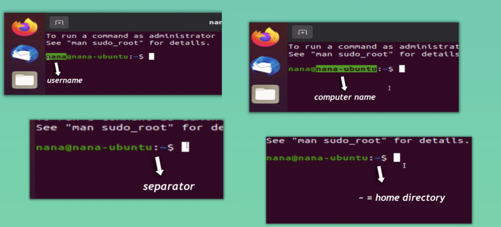
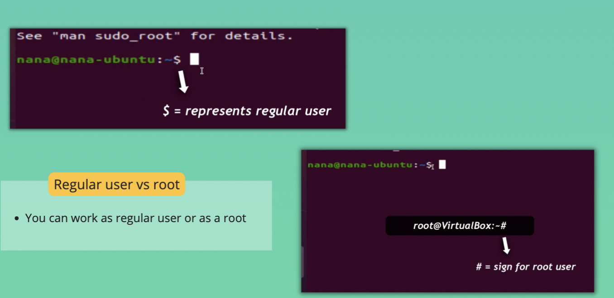
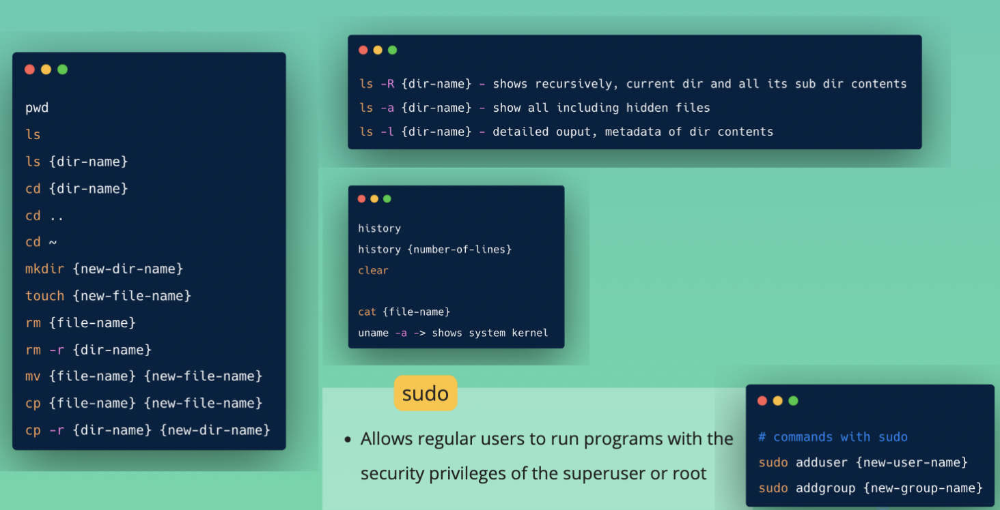

# Introduction to CLI

## GUI VS CLI
GUI = Graphical User Interface
CLI = Command Line Interface
### Why CLI over GUI?
* work more efficient
* Easier for bulk operations
* Cli is more powerful 

## CLI

## Basic Linux Commands
