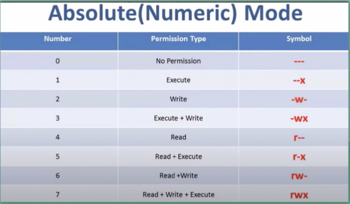

# Files ownership and permissions
* User permissions are related to reading, writing and executing
* Each files and folders has 2 different onwers: users and groups

### List file permissions
`ls -al`
### 3 ways to set or change persmission
1. Symbolic mode: 
`+` add  r w x  
`-` remove  r w x 

1. Numberic Mode 
4 read 
2 write 
1 execut 
0 no permision 

1. Set permission 
 `=rwx`