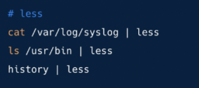
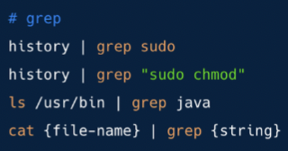
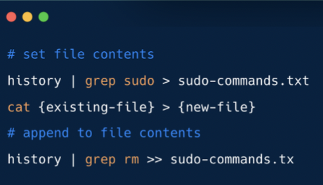

# Linux basic comamnd lines - pipe, grep and redirect
* Every program has __Input__ and __Output__
* The output from one program can become the input of another command 

## "pipe" command: |
pipes the output of the previous command as an input to the next command

## "less"
Displays the content of a file or a command output one page at a time 

## "grep"
Search for a particular pattern 

## "redirect" command: > / >>
Takes the output from a previous command and write it into a file
