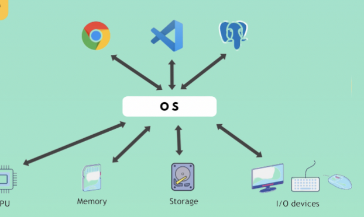
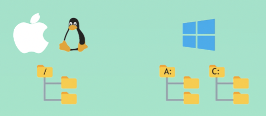
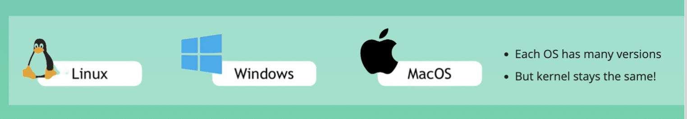
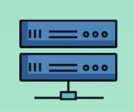

# Introduction to OS

## What is OS?

### OS is a sofrware manage:
 * computer hardware
 * software resources
 * provide common services for computer programs

 ### OS as abstraction layer between applications and hardware
 * Instead of applications(like browser) interact with computer hardware directly, they can use OS as the abtraction layer between the two
 * Messy, if all the apps have to talk to the hardware directly
 * Apps, like browser can't be installed directly on hardware 
 

## Task of an OS

 ### Resource allocation and management 
 OS manages resources among applications:
 * __Process management(CPU)__
 * __Memeory management(RAM)__
 * __Storage management(HD)__

 ### File Management
 * __Files are stored in structured way__
 * __A file system is organzied into directories__
 * __On Unix sysyem: treefile system__
  
 * __On Windows OS: multiple root folders__
  

 ### Device Management 

 ### Other important tasks
  * __Security__
  * __Networking__

  ## OS Components 
  * __Kernel__
  * __Application Layer__

  ## 3 main OS
  

  ## Clinet OS vs Server OS

  ### Clinet OS
  Personal computers iwth GUI and I/OS devices 
   
  ### Server OS
  Linux and Windows have server distributions, but Linux most widely used, more light-wieght. And there is no GUI or other user aplications.  
  