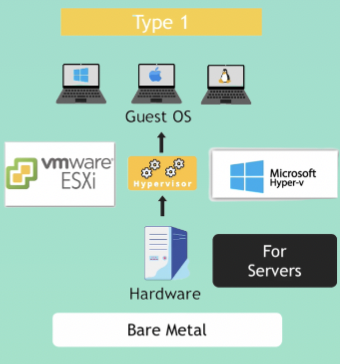
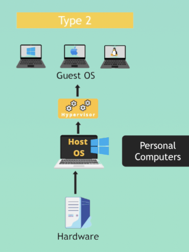

# Intro to Virtualization & Virtual Machines
VM is a virtual computer running on top of another host computer

## How VM works
* Virtualization is the process of creating a software-based, or "virtual" version of a computer, with deicated amounts of CPU, memroy and storagethat are "borrowed" from the physical host computer 
* Make it possible that any OS can run the top of any other physical host machine. 
* The VM is partitioned withe the rest of system, which makes it completely isolated and cannot interfere with the host computer's parimary OS

## Hypervisor
* The essential component in the virtualization stack is a piece of software called __hypervisor__
  *  Native or Bare Metal: Run directly on the host's hardware 
  

  *  Hosted: Run with a traditional OS 
  
* The most popular __hypervisor__ open-source is __Oracle VM VirtualBox__

## Why companies adopt Virtualization
* Security
* Agility and Speedy
* cost savings
* Portable

