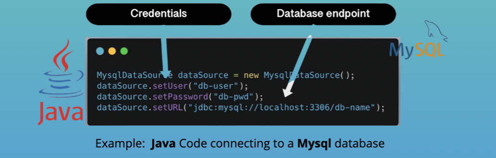

# Datasbe
Users can create, read, update or delete entries in a database. Also called CRUD operations

## Database in software development process 
* Developers need database for local development
  * Connect to a development database to develop the new features
  * Connect to a test database to test the new feature with realistic data...
* 2 ways for developers to work with DB
  * option 1:
     * Each developer installs DB locally
     * Each developer has own DB with own test data

  * option 2:
     * Shared DB hosted remotely

## Configure Database Connection 
  
 * The DB connection is configured in the application's code
 * Each programming language has a library/module for DB connection
 * You have to tell the library:
    * WHICH database to talk to -> Database endpoint
    * HOW to AUTHENTICATE with that DB -> Crendentials
 
* Do not hardcode database connection data in source code
* DON'T check incredentials in code
    * Define only variables in code
    * Set endpoint and credentials from outside for each environment(for example dev, test, prod)
    * Depending on environment (dev, test, prod) connects to differentDB!
* Pass environment variables on application start-up:
    * From Command Line
    * Configure in code editor
    * Use properties/configuration files
 

## Databases in Production

Application connects to database. This means database needs to be available , when application starts. So before application is deployed, we need to install and configure database. 

### Data base is IMPORTANT, need to:
* Replicate database
* Do regular backups
* Make sure it performs under high load