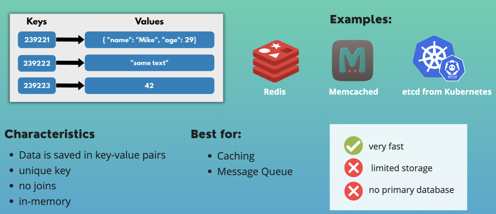
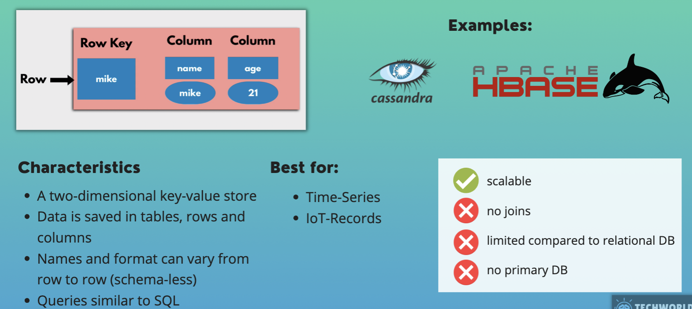
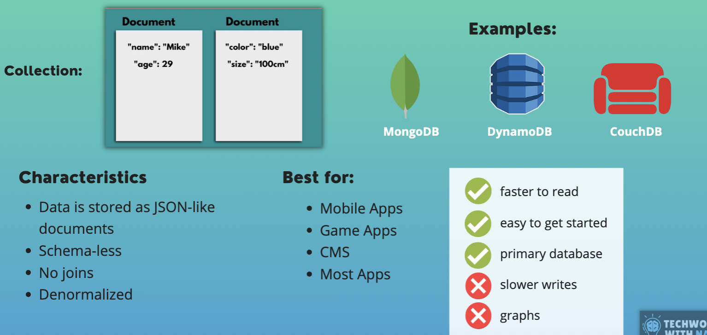
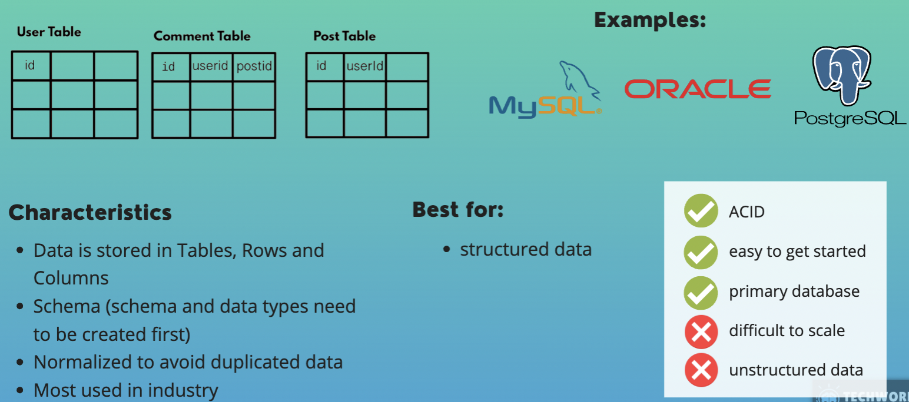
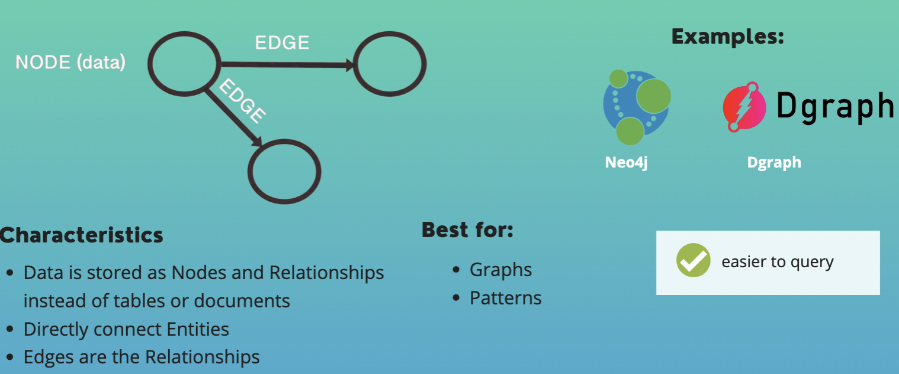
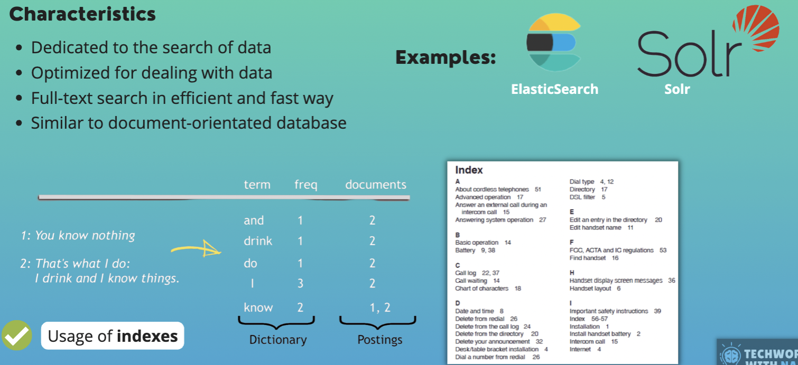

# Database Type

* Many different database types available
* They have different characteristics for different use cases
* Each of them has benefits and disadvantages

## 1. Key Value Databases
 

## 2. Wide Column Databases
 

## 3. Document Databases
 

## 4. Relational Databases
 

### SQL vs No-SQL
Because relational or SQL databases are so popular,often we talk about SQL vs No-SQL, meaning all the other database types, which are schema-less.

## 5. Graph Databases
 

## 6. Search-Engine Databases
 
