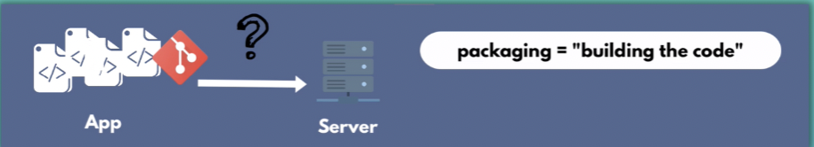
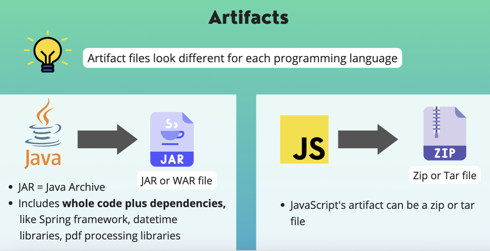

# Intro to Build Tools 

## What are Build and Package Manager Tools? 

Application needs to be deployed on a production server. For that, we want to package application into a single moveable file (artifact), also called "building the code". This is what a build tool or package manager tool does. 
 

## What is an "artifact"?
Includes application code and all its dependencies.
 

## What does "building the code" mean?
* Compiling the code
* Compressing the code
* Package hundred of files to 1 single file

## What is an "artifact repository"?
* Storage for artifacts
* To deploy it for example multiple times, have backup etc.

## Different Build Tools for different programming languages

* Java Build Tools: Gradle and Maven
* JavaScript Package Manager: npm

