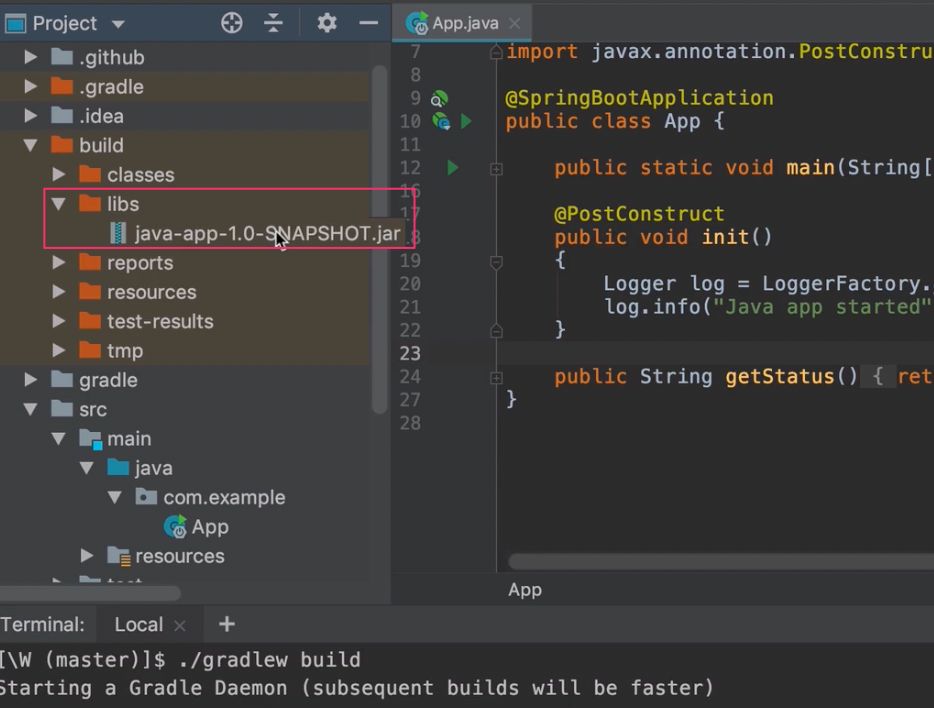
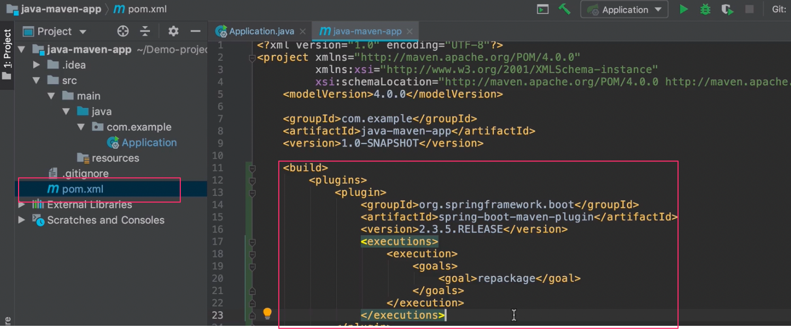
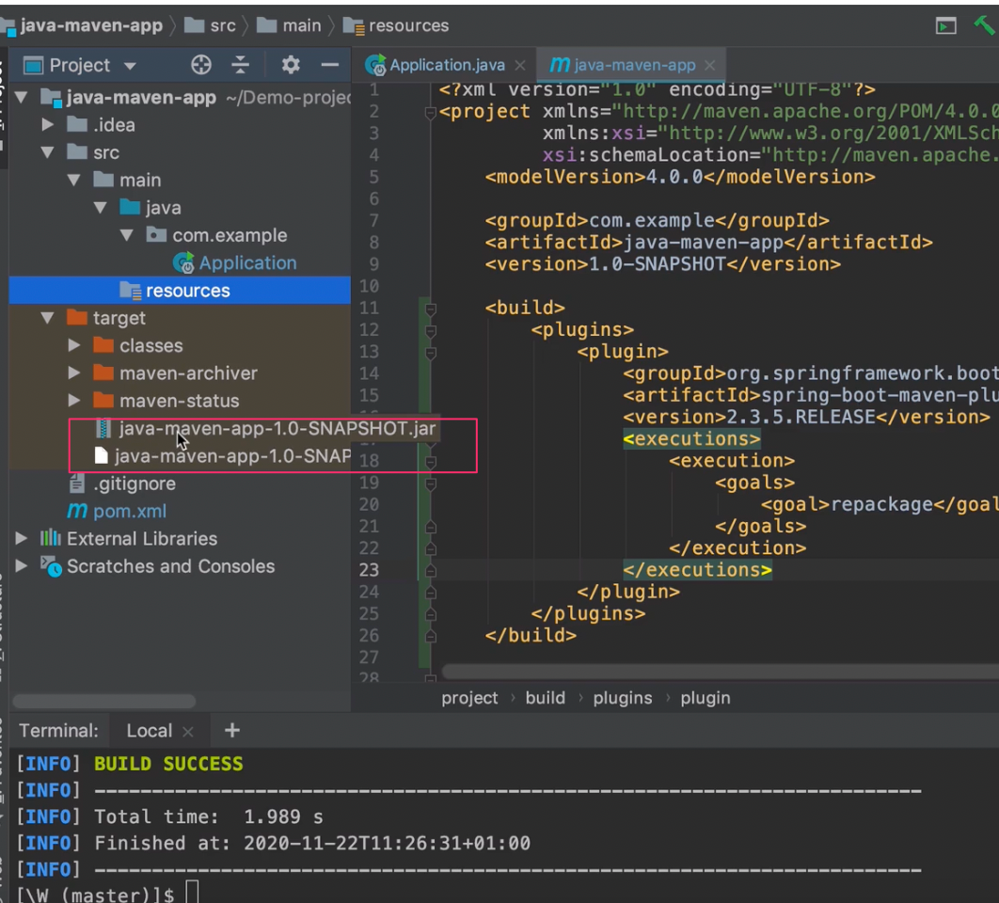
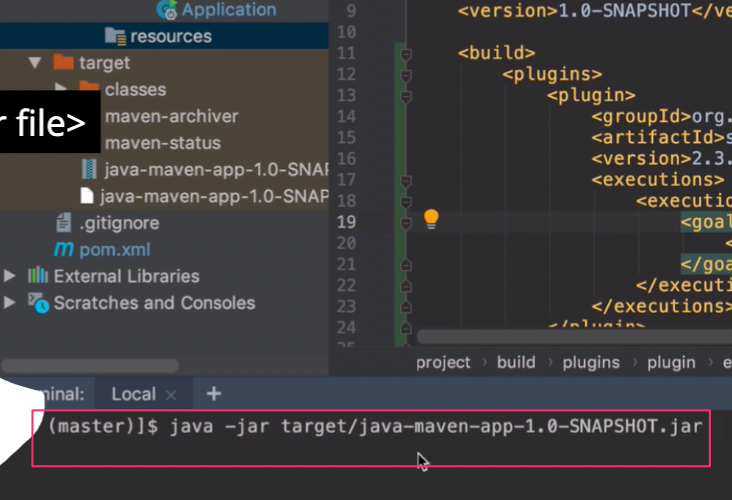

# Build and Run an artifact
* Using a build/pakcage tool
* Specific to the programming language
* Install dependecies
* Complie and comporess the code

## "Build" Process in Maven or Gradle:
* Gradle 
  * Configuration in XML
  * build command - `./gradlew build` 
  
* Maven 
  * Configuration in Groovy 
  
  * build command - `mvn install` 
  

## Run a Java application

* Locally: `java -jar <name of jar file>`
* On a deployment server: Copy the jar file to server, where applicationshould run and execute `java -jar` command. 

