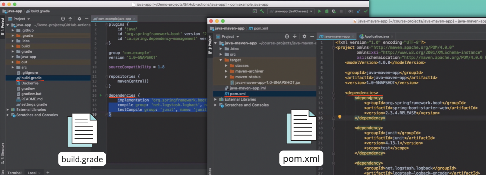

# Build Tools for Software Development 
* Developers need build tools locally when developing the application
* A build tool is used to manage the dependencies of a project
* Build tools have a dependencies file:
 