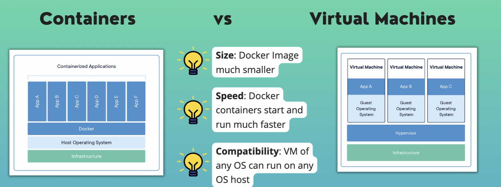

# Container vs Virtual Machine
Both are virtualization tools

## Container
* Abstraction at the app layer
* Multiple containers share the OS kernel

## Virtual Machines
* Abstraction of physical hardware
* Each VM includes a full copy of an OS

 