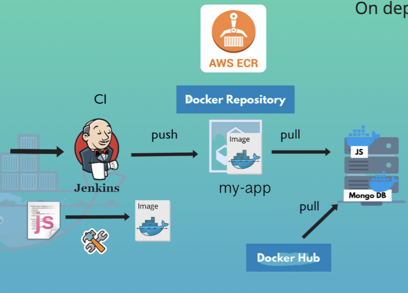

# Private Docker Repository

When you work in a company, you will be working with a private docker registry

## Public reposiroty
* DockerHub:`docker.io` is default repository: 
`docker pull mongo:4.2` = `docker pull docker.io/library/mongo:4.2`

## Private reposiroty
* AWS ECR: Need to include the registry domain 
`dockerpull523450290.dkr.ecr.eu-central-1.amazonaws.com/my-app:1.0`

## Deploy Docker Containers on a Remote Server
 