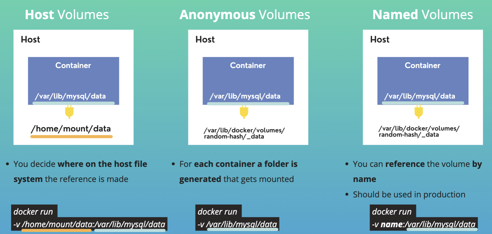

# Docker Volumes
Volumes are the way to persist data generated by and used by Docker containers

## Why Volume are needed for persistence?
Data is stored on the virtual file system of the container. So when container is removed, the data is deleted as well.

## How Docker Volumes work?
<br/>

`docker-compose.yaml`
```version: '3'
services:
  mongodb:
    image: mongo
    ports:
     - 27017:27017
    environment:
     - MONGO_INITDB_ROOT_USERNAME=admin
     - MONGO_INITDB_ROOT_PASSWORD=password
    volumes: <--
     - mongo-data:/data/db <--
  mongo-express:
    image: mongo-express
    restart: always
    ports:
     - 8080:8081
    environment:
     - ME_CONFIG_MONGODB_ADMINUSERNAME=admin
     - ME_CONFIG_MONGODB_ADMINPASSWORD=password
     - ME_CONFIG_MONGODB_SERVER=mongodb
    depends_on:
     - "mongodb"
volumes: <--
  mongo-data: <--
    driver: local <---