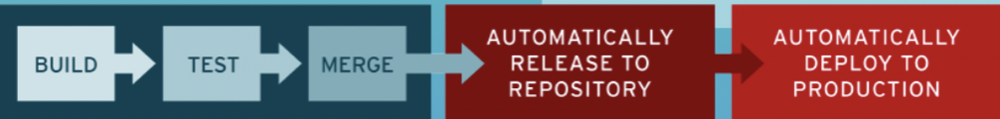

# Intro to Build Automation

## What is Build Automation? 
Build automation is the process of automating the:
* retrieval of source code
* executing automated tests
* compiling into binary code/build docker image
* push artifact to repository
* deploy artifact

## What is CI / CD ?
* CI/CD stands for Continuous Integration / Continuous Deployment
* Goal of CI/CD is to "release early and often". And the way to do this, is by automating thewhole software release cycle

### Continuous Integration
* Means new code changes arecontinuously built, tested andmerged to shared repository.

### Continuous deployment
* Automating further stages of thepipeline
* Automatically deploying to different deployment environments including releasing to production 
