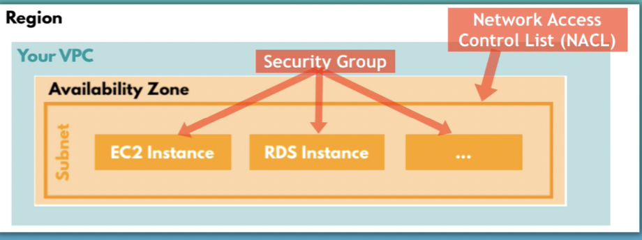

# Intro to AWS 
Amazon Web Services, currently most popular cloud platform, with a hugecollection of services.

## AWS Account and Services Scope
In AWS you have 3 scopes: Global, Region and Availability Zones. Different resources will be created in one of those scopes.

## Core AWS Service

* ### Identity and Access Management (IAM) 
  * ith IAM service you can specify who can access which services and resources
  * Create and manage AWS Users and Groups
  * Assign policies (set of permissions)
  * ROOT user is created by default
  * ROOT user has unlimited privileges
  * Best Practice: Create an admin user with less privileges that managesthe whole AWS account
  * Different Types of IAM Users: Human usesr and system users
  * Groups: For granting access to multiple IAM users
  * IAM Roles: 
    * IAM role is similar to an IAM user
    * Instead of being uniquely associated with one person, a role is intended to be assumable by anyone who needs it
    * Also Policies cannot be assigned to AWS services directly
    * So role is used to grant AWS services access to other AWS services

* ### Regions & Availability Zones (AZ) 
   * Cloud providers have physical data centers
   * Data centers all over the world
   * Region = physical location, where data centers are clustered
   * Each group of logical data centers is called an Availability Zone
   * Availability Zones = one or more discrete data centers

* ### Virtual Private Cloud (VPC)
  * VPC is your own isolated networkin the cloud
  * You have a VPC for each Region
  * VPC spans all the AZ (Subnet) in that Region
  * Multiple VPCs in different Regions
  * VPC is like a virtual representation of networkinfrastructure: Server setup, network configurationmoved to cloud

* ### Subnet 
  * Subnet is a range of IP addresses in your VPC
  * It's like a private network inside a network
  * You have a subnet for each Availability Zone
  * Based on firewall configuration you can have a private and/or public subnet
  * A subnet has a default range of internal IP addresses
  * When you create a new resource like EC2 instance then an IP address is assigned within this subnet's IP range
  * For communication inside the VPC

* ### Internet Gateway
Using an internet gateway you can connect the VPC or its subnets to the outside internet

* ### Security - Controlling Access
  * Control access to your VPC
  * Control access to your individual server instances
  * NACL: Configure access on subnet level
  * Security Group: Configure access on instance leve 
   

* ### CIDR Block
  * When you create a subnet, you specify the IPv4CIDR block for the subnet, which is a subset of the VPC CIDR block
  * Defines a range of IP addresses
  * CIDR = Classless Inter-Domain Routing   

* ### Elastic Compute Cloud (EC2)
A virtual server in AWS Cloud, providing computing capacity
