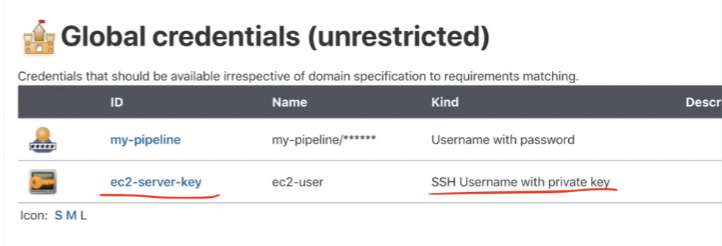

# Deploy to EC2 Instance from Jenkins

* Connect to EC2 instance from Jenkins server via ssh (ssh agent):
 * Install SS agent Plugin 
 
 * Configure credential 
 
 * use credential in`deploy` stage in Jenkinsfile. 
 
* Execute "docker run" on EC2 instance