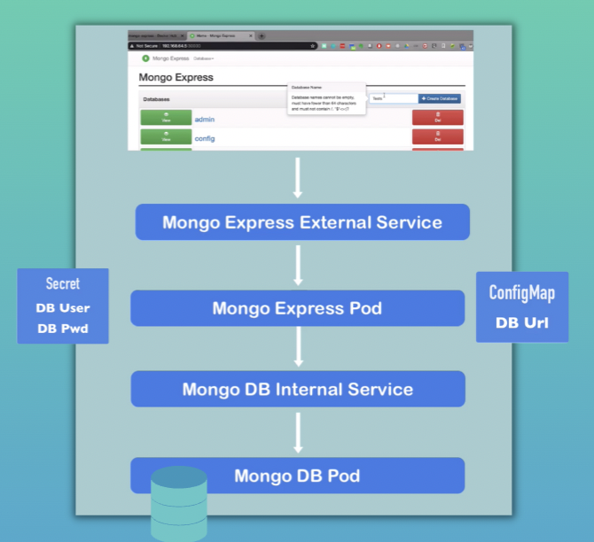

# MongoDB and Mongo Express demo
Example Setup</br>


* Mongo Express as UI
* MongoDB as database
* User updates entries in database via browser
* ConfigMap and Secret holds the MongoDB'sendpoint (Service name of MongoDB) and credentials (user, pwd), which gets injected toMongoExpress Pod, so MongoExpress can connectto the DB

* ## deploy the secret configuration first 
`echo -n 'username' | base64`

```bash
dXNlcm5hbWU=
```

`echo -n 'password' | base64`

```bash
dXNlcm5hbWU=
```

`mongo-secret.yaml`

```bash
apiVersion: v1
**kind: Secret <--**
metadata:
    name: mongodb-secret
type: Opaque
data:
    mongo-root-username: dXNlcm5hbWU=
    mongo-root-password: cGFzc3dvcmQ=
```

`kubectl apply -f mongo-secret.yaml`
```bash
secret/mongodb-secret created
```

`kubectl get secret`

```bash
NAME             TYPE     DATA   AGE
mongodb-secret   Opaque   2      3m55s
```
* ## Create a mongoDB deployment
`mongo.yaml`

```bash
apiVersion: apps/v1
kind: Deployment
metadata:
  name: mongodb-deployment
  labels:
    app: mongodb
spec:
  replicas: 1
  selector:
    matchLabels:
      app: mongodb
  template:
    metadata:
      labels:
        app: mongodb
    spec:
      containers:
      - name: mongodb
        image: mongo
        ports:
        - containerPort: 27017
        env:
        - name: MONGO_INITDB_ROOT_USERNAME
          valueFrom:
            secretKeyRef:
              name: mongodb-secret
              key: mongo-root-username
        - name: MONGO_INITDB_ROOT_PASSWORD
          valueFrom: 
            secretKeyRef:
              name: mongodb-secret
              key: mongo-root-password
```

`kubectl apply -f mongo.yaml`

`kubectl get all`

```bash
NAME                                      READY   STATUS    RESTARTS   AGE
pod/mongodb-deployment-844789cd64-ltq6j   1/1     Running   0          10s

NAME                 TYPE        CLUSTER-IP   EXTERNAL-IP   PORT(S)   AGE
service/kubernetes   ClusterIP   10.96.0.1    <none>        443/TCP   2d8h

NAME                                 READY   UP-TO-DATE   AVAILABLE   AGE
deployment.apps/mongodb-deployment   1/1     1            1           10s

NAME                                            DESIRED   CURRENT   READY   AGE
replicaset.apps/mongodb-deployment-844789cd64   1         1         1       10s
```

`kubectl get pod -o wide`

```bash
NAME                                  READY   STATUS    RESTARTS   AGE     IP           NODE       NOMINATED NODE   READINESS GATES
mongodb-deployment-844789cd64-ltq6j   1/1     Running   0          2m56s   172.17.0.3   minikube   <none>           <none>
```

* ## Create internal service for MongoDB Pod
`service.yaml` inside of `mongo.yaml` deployment file:
```
apiVersion: v1
kind: Service
metadata:
  name: mongodb-service
spec:
  selector:
    app: mongodb
  ports:
    - protocol: TCP
      port: 27017 //the two ports here can be different, internal service port
      targetPort: 27017 // container port/service endpoint
```
`kubectl apply -f mongo.yaml`

```bash
deployment.apps/mongodb-deployment unchanged
service/mongodb-service created
```

`kubectl get service` 

```bash
NAME              TYPE        CLUSTER-IP      EXTERNAL-IP   PORT(S)     AGE
kubernetes        ClusterIP   10.96.0.1       <none>        443/TCP     2d9h
mongodb-service   ClusterIP   10.100.16.243   <none>        27017/TCP   38s
```

* ## Create mongo-express deployment
**ConfigMap**

`mongo-configmap.yaml`

```bash
apiVersion: v1
**kind: ConfigMap <--**
metadata:
  name: mongodb-configmap
data:
  database_url: mongodb-service // name of the mongoDB service 
```

`kubectl apply -f mongo-configmap.yaml`

```bash
configmap/mongodb-configmap created
```

`kubectl get ConfigMap`

```bash
NAME                DATA   AGE
kube-root-ca.crt    1      2d9h
mongodb-configmap   1      18s <--
```
* ## Create mongo-express deployment 
`mongo-express.yaml`

```bash
apiVersion: apps/v1
kind: Deployment
metadata:
  name: mongo-express
  labels:
    app: mongo-express
spec:
  replicas: 1
  selector:
    matchLabels:
      app: mongo-express
  template:
    metadata:
      labels:
        app: mongo-express
    spec:
      containers:
      - name: mongo-express
        image: mongo-express
        ports:
        - containerPort: 8081
        env:
        - name: ME_CONFIG_MONGODB_ADMINUSERNAME
          valueFrom:
            secretKeyRef:
              name: mongodb-secret
              key: mongo-root-username
        - name: ME_CONFIG_MONGODB_ADMINPASSWORD
          valueFrom: 
            secretKeyRef:
              name: mongodb-secret
              key: mongo-root-password
        - name: ME_CONFIG_MONGODB_SERVER
          valueFrom: 
            configMapKeyRef: // Refer to the mongo-configmap.yaml
              name: mongodb-configmap
              key: database_url

```

`kubectl apply -f mongo-express.yaml`

```bash
deployment.apps/mongo-express created
```

`kubectl get pod`

```bash
NAME                                  READY   STATUS    RESTARTS   AGE
mongo-express-5bf4b56f47-4h2tw        1/1     Running   0          21s
mongodb-deployment-844789cd64-ltq6j   1/1     Running   0          41m
```
* ## Create external service for Mongo-express
mongo-express service:

```bash
---
apiVersion: v1
kind: Service
metadata:
  name: mongo-express-service
spec:
  selector:
    app: mongo-express
  type: LoadBalancer  //Assigns service an external IP address and accptes requests from external
  ports:
    - protocol: TCP
      port: 8081
      targetPort: 8081
      nodePort: 30000 //port for external IP addrese, the port number should be between 30000-32767
```

`kubectl apply -f mongo-express.yaml`

```bash
deployment.apps/mongo-express unchanged
service/mongo-express-service created
```

`kubectl get service`

```bash
NAME                    TYPE           CLUSTER-IP      EXTERNAL-IP   PORT(S)          AGE
kubernetes              ClusterIP      10.96.0.1       <none>        443/TCP          2d9h
mongo-express-service   LoadBalancer   10.105.208.86   <pending>     8081:30000/TCP   42s
mongodb-service         ClusterIP      10.100.16.243   <none>        27017/TCP        51m
```

`minikube service mongo-express-service`

```bash
|-----------|-----------------------|-------------|---------------------------|
| NAMESPACE |         NAME          | TARGET PORT |            URL            |
|-----------|-----------------------|-------------|---------------------------|
| default   | mongo-express-service |        8081 | http://192.168.49.2:30000 |
|-----------|-----------------------|-------------|---------------------------|
🏃  Starting tunnel for service mongo-express-service.
|-----------|-----------------------|-------------|------------------------|
| NAMESPACE |         NAME          | TARGET PORT |          URL           |
|-----------|-----------------------|-------------|------------------------|
| default   | mongo-express-service |             | http://127.0.0.1:57460 |
|-----------|-----------------------|-------------|------------------------|
🎉  Opening service default/mongo-express-service in default browser...
❗  Because you are using a Docker driver on darwin, the terminal needs to be open to run it.
```