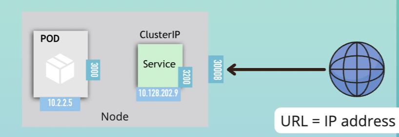
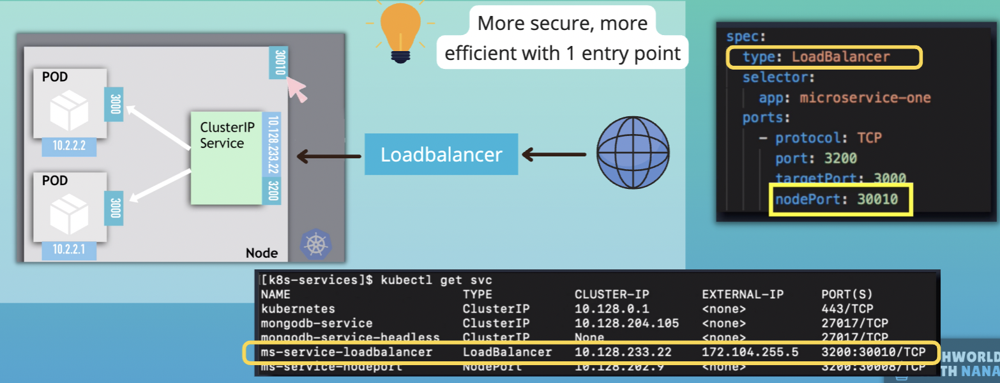

# Kubernetes Services 

* Abstract way to expose an application running on a set of Pods
* Different types of services:
  * Cluster IP
  * Nodeport
  * loadbalancer

## ClusterIP Service & its subtypes
* ClusterIP is an internal service, not accessible from outside the cluster
* All Pods in the cluster can talk to this internal service

### Headless Internal Service
* When client needs to communicate with 1 specific Pod directly, instead of randomly selected
* Use Case: When Pod replicas are not identical. For example stateful apps, like when only master is allowed to write to database

### Multi-Port Internal Servic
* When you need to expose more than 1 port K8s lets you configure multiple port definitions on a Service In that case, you must give all of your ports names so that these are unambiguous

## NodePort Service
* Unlike internal Service, is accessible directly from outside cluster. Exposes the Service on each Node's IP at a static port
* A ClusterIP Service, to which the NodePortService routes, is automatically created 

## Loadbalancer Service
* Exposes the Service externally using a cloud provider's load balancer
* NodePort and ClusterIP Services, to which the external load balancer routes, are automatically created
