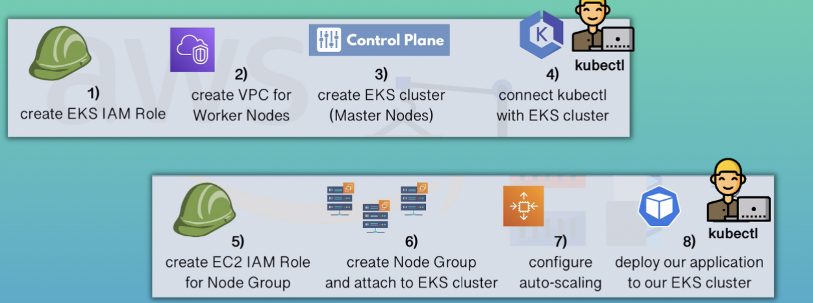

# EKS
* Control Plane: Scheduling and Orchestration
* Worker Nodes: Compute Flee
* EKS deploys and manages K8s Control Plane Nodes
* K8s Control Plane services are already installed
* High Availability: Control Plane Nodes replicatedacross Availability Zones

## EKS with EC2 Instances
* You need to manage theinfrastructure of Worker Nodes

## EKS with Nodegroup
* Creates, deletes EC2 instances for you, but you need to configure nodegroup.

## EKS with Fargate
* Fully managed Worker Nodes by AWS

## High-Level Steps to create an EKS cluster
1. Provision an EKScluster (Control PlaneNodes)
2. Create Nodegroup of EC2 Instances(Worker Nodes)
3. Connect Nodegroup to EKS cluster
4. Deploy your containerized applications

## Detailed Steps to create an EKS cluster 



## Create eks by `eksctl`

* ### Update/Install `eksctl` CLI

[https://docs.aws.amazon.com/eks/latest/userguide/eksctl.html](https://docs.aws.amazon.com/eks/latest/userguide/eksctl.html)

* ### configure AWS admin user:

```yaml
aws configure list
      Name                    Value             Type    Location
      ----                    -----             ----    --------
   profile                <not set>             None    None
access_key     ****************MKV6 shared-credentials-file
secret_key     ****************ztsF shared-credentials-file
    region           ap-southeast-2      config-file    ~/.aws/config
```

* ### Create EKS cluster:

```yaml
eksctl create cluster --name eks-cluster --region ap-southeast-2 --version 1.23 --vpc-private-subnets subnet-0b2c71484e160e40a,subnet-0db25b0013c72d0fc --without-nodegroup
```

```yaml
eksctl create cluster --name eks-cluster --region ap-southeast-2 --version 1.23 --nodegroup-name eks-nodegroup --node-type t3.small --nodes 1 --nodes-min 1 --nodes-max 2
```

OR

**Using Config Files**

[https://eksctl.io/usage/creating-and-managing-clusters/#using-config-files](https://eksctl.io/usage/creating-and-managing-clusters/#using-config-files)

`cluster.yaml`

```yaml
apiVersion: eksctl.io/v1alpha5
kind: ClusterConfig

metadata:
  name: eks-cluster-2
  region: ap-southeast-2

vpc:
  subnets:
    private:
      ap-southeast-2a: { id: subnet-0b2c71484e160e40a }
      ap-southeast-2b: { id: subnet-0db25b0013c72d0fc }

nodeGroups:
  - name: eks-node-group
    instanceType: t3.small
    maxSize: 3
    minSize: 1
    desiredCapacity: 1
```

## Delete cluster

`eksctl delete cluster --region=ap-southeast-2 --name=eks-cluster-demo`