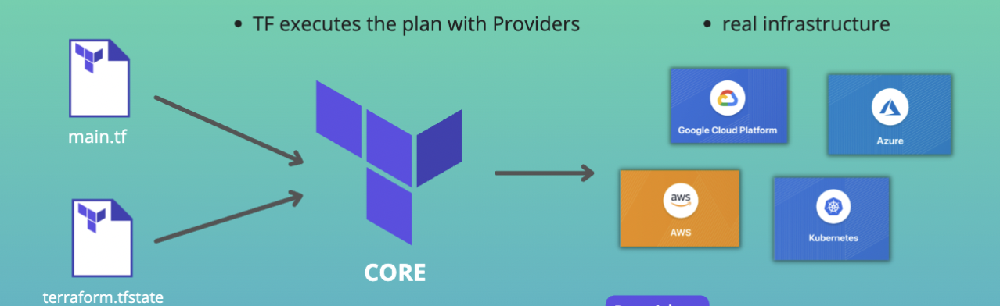

# Introduction to Terraform 
* An open-source infrastructure as code (IaC) tool by HashiCorp
* automate and manage: 
  * infrastructure
  * plaform
  * services that run on the platform
* By defining the resources in human-readable configuration files
* Definition of configuration files is declarative

## Infrastructure Provisioning
* Private Network space
* EC2 server instances
* Install Docker and other tools
* Configure Security
...

## Manage existing infratructure
* Automate the continuous changes to infrastructure

## Replicating Infrastructure
* Easily replicate infrastructureon different environments,like DEV, STAGING, PROD

## How Terraform works 
* An important part of Terraform (TF) is that TF knows, your desired state (config file) and keeps track of your existing real infrastructure (in a state file)

* TF compares your desired with actual state to know which changes it needs to make to your infrastructure

* Without state, you would always have to check the current state yourself and see how to update your desired state!

* Write -> Plan -> Apply

## Terraform Architecture

## Core Terraform Commands

`terraform init`
`terrraform plan`
`terraform apply`
`terraform apply --auto-approve`
`terraform destroy`
`terraform destroy --auto-approve`