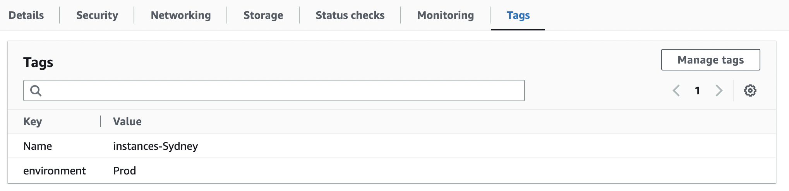
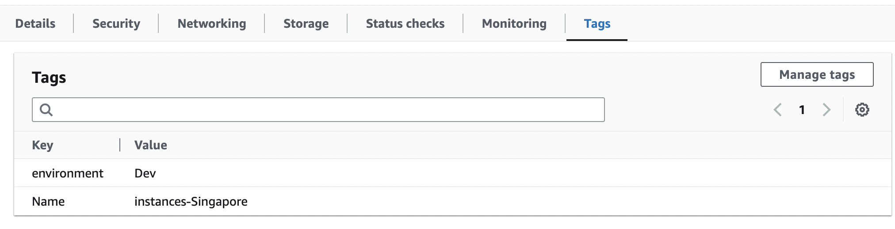

# Add tags to EC2 instances
We need:

`boto3`

`boto3.client.describe_instances()`

`boto3.resource.create_tags()`

```python
import boto3

# Sydney
ec2_client_Sydney = boto3.client('ec2', region_name="ap-southeast-2")
ec2_resource_Sydney = boto3.resource('ec2', region_name="ap-southeast-2")

# Singapore
ec2_client_Singapore = boto3.client('ec2', region_name="ap-southeast-1")
ec2_resource_Singapore = boto3.resource('ec2', region_name="ap-southeast-1")

# Sydney
reservations_Sydney = ec2_client_Sydney.describe_instances()['Reservations']
instances_Sydney = []
for reservation in reservations_Sydney:
    instances = reservation['Instances']
    for instance in instances:
        instances_Sydney.append(instance['InstanceId'])
        print(instances_Sydney)

# Singapore
reservations_Singapore = ec2_client_Singapore.describe_instances()['Reservations']
instances_Singapore = []
for reservation in reservations_Singapore:
    instances = reservation['Instances']
    for instance in instances:
        instances_Singapore.append(instance['InstanceId'])

# Sydney
response = ec2_resource_Sydney.create_tags(
    Resources=instances_Sydney,
    Tags=[
        {
            'Key': 'environment',
            'Value': 'Prod'
        },
    ]
)

# Singapore
response = ec2_resource_Singapore.create_tags(
    Resources=instances_Singapore,
    Tags=[
        {
            'Key': 'environment',
            'Value': 'Dev'
        },
    ]
)
```
## Result on AWS

