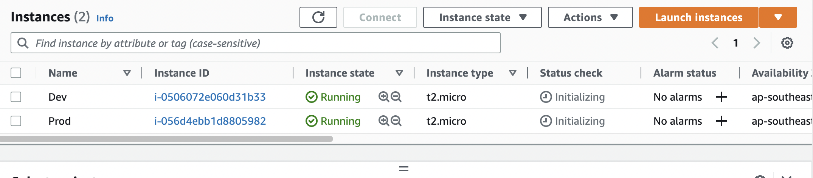
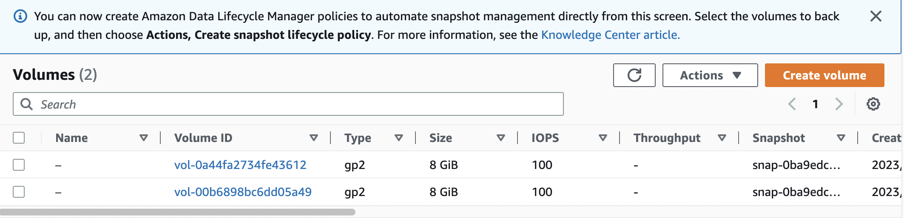
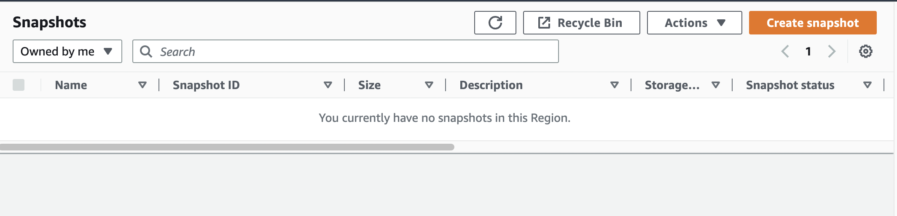
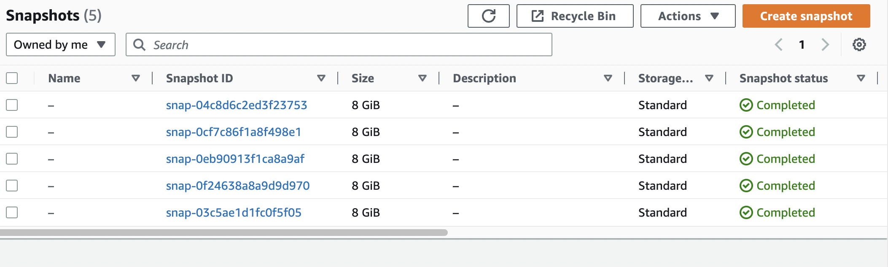

# Backup EC2 Volumes

## Create two EC2 instances:


### Volumes



### Snapshots


## Create snapshots for volume(EC2 volumes) by Python:

`describe.volumes()`

`create.snapshots()`

```python
import boto3
import schedule

ec2_client = boto3.client('ec2')

def create_snapshots():
    volumes = ec2_client.describe_volumes(
        Filters=[
            {
                'Name': 'tag:Name',
                'Values': [
                    'Prod',
                ]
            },
        ],
    )['Volumes']
    for volume in volumes:
        snap_shot = ec2_client.create_snapshot(
            VolumeId=volume['VolumeId'],
        )
        print(snap_shot)

schedule.every(10).seconds.do(create_snapshots)
while True:
    schedule.run_pending()
```
## Result in AWS

