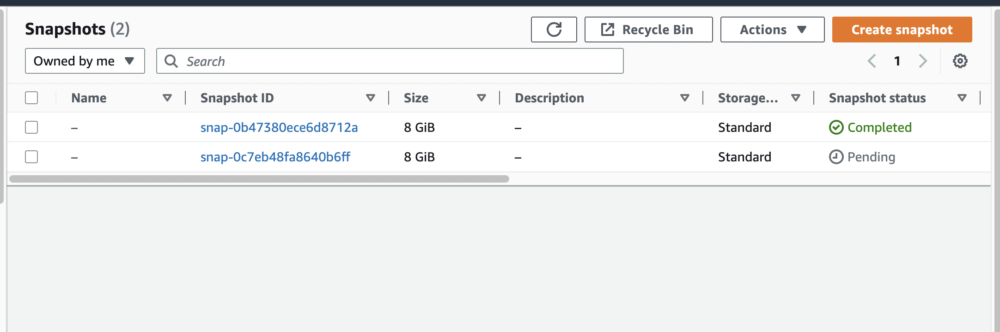

# Cleanup old snapshots

`itemgetter()`

**`itemgetter`** is a built-in function from the **`operator`** module in Python that is used to extract values from objects, such as dictionaries, lists, and tuples, based on a specified index or key.

Here's an example of using **`itemgetter`** to sort a list of dictionaries based on a specific key:

```python
from operator import itemgetter

events = [
    {'name': 'Event A', 'timestamp': '2022-01-01 10:00:00'},
    {'name': 'Event B', 'timestamp': '2022-02-01 10:00:00'},
    {'name': 'Event C', 'timestamp': '2021-12-01 10:00:00'},
]

sorted_events = sorted(events, key=itemgetter('timestamp'))

for event in sorted_events:
    print(event['name'], event['timestamp'])
```

```python
import boto3
from operator import itemgetter

ec2_client = boto3.client('ec2')

# get all the prod tagged volumes
volumes = ec2_client.describe_volumes(
    Filters=[
        {
            'Name': 'tag:Name',
            'Values': [
                'Prod',
            ]
        },
    ],
)['Volumes']
# loop the volumes list to get snapshots that created by our own also with prod tag

for volume in volumes:
    print(volume['VolumeId'])

    snapshots = ec2_client.describe_snapshots(
        OwnerIds=[
            'self',
        ],
        Filters=[
            {
                'Name': 'volume-id',
                'Values': [
                    volume['VolumeId'],
                ]
            },
        ],
    )['Snapshots']
# Sort the snapshots we get by time 
sorted_snapshots = sorted(snapshots, key=itemgetter('StartTime'), reverse=True)

# Keep the latest 2 snapshots and delete the rest.
for snapshot in sorted_snapshots[2:]:
    ec2_client.delete_snapshot(
        SnapshotId=snapshot['SnapshotId'],
    )

for snapshot in sorted_snapshots:
    print(snapshot['SnapshotId'], snapshot['StartTime'])
```
## Result in AWS
