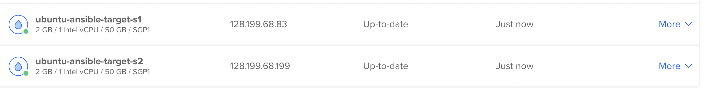
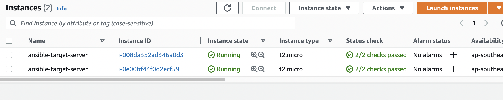

# Setup Ansible

## Install Ansible

[https://docs.ansible.com/ansible/latest/installation_guide/intro_installation.html](https://docs.ansible.com/ansible/latest/installation_guide/intro_installation.html)

To verify whether `pip` is already installed for your preferred Python:

**`$** python3 -m pip -V`

Install Ansible

`python3 -m pip install --user ansible`

Upgrade Ansible

`python3 -m pip install --upgrade --user ansible`

To check the version of the `ansible` package that has been installed:

**`$** python3 -m pip show ansible`

```python
Name: ansible
Version: 7.2.0
Summary: Radically simple IT automation
Home-page: https://ansible.com/
Author: Ansible, Inc.
Author-email: info@ansible.com
License: GPLv3+
Location: /Users/zqwang/Library/Python/3.11/lib/python/site-packages
```

Export to current terminal only:

`export PATH="${HOME}/Library/Python/3.10/bin:${PATH}"`

`export PATH="/Library/Frameworks/Python.framework/Versions/3.10/bin:${PATH}"`

Export to global

`echo 'export PATH=${HOME}/Library/Python/3.10/bin:${PATH}' >> ~/.zshrc`

OR

`brew install ansible` got issue when installed `Nginx`


## Setup target servers with Digital Ocean droplets



### Checking if servers have python3 installed

```python
root@ubuntu-ansible-target-s1:/usr/bin# ls | grep python
pybabel-python3
python3
python3.10
```

### Create a host file(Ansible inventory list):

`/Users/zqwang/bootcamp-projects/ansible`

`hosts` file

```python
[droplet]
128.199.68.83 ansible_ssh_private_key_file=~/.ssh/id_rsa ansible_user=root
128.199.68.199 ansible_ssh_private_key_file=~/.ssh/id_rsa ansible_user=root
```

**Try to ping the target servers to check if the inventory list is setup successfully:**

`ansible all -i hosts -m ping`

```python

The authenticity of host '128.199.68.199 (128.199.68.199)' can't be established.
ED25519 key fingerprint is SHA256:FwY+hKLlEOujNI8zOM/RVOAoalWp7f5q1MBNCAcOowQ.
This key is not known by any other names
Are you sure you want to continue connecting (yes/no/[fingerprint])? 128.199.68.83 | SUCCESS => {
    "ansible_facts": {
        "discovered_interpreter_python": "/usr/bin/python3"
    },
    "changed": false,
    "ping": "pong"
}
yes
128.199.68.199 | SUCCESS => {
    "ansible_facts": {
        "discovered_interpreter_python": "/usr/bin/python3"
    },
    "changed": false,
    "ping": "pong"
}
❯ ansible all -i hosts -m ping
128.199.68.199 | SUCCESS => {
    "ansible_facts": {
        "discovered_interpreter_python": "/usr/bin/python3"
    },
    "changed": false,
    "ping": "pong"
}
128.199.68.83 | SUCCESS => {
    "ansible_facts": {
        "discovered_interpreter_python": "/usr/bin/python3"
    },
    "changed": false,
    "ping": "pong"
}
```

`ansible droplet -i hosts -m ping`

```python
❯ ansible droplet -i hosts -m ping
128.199.68.83 | SUCCESS => {
    "ansible_facts": {
        "discovered_interpreter_python": "/usr/bin/python3"
    },
    "changed": false,
    "ping": "pong"
}
128.199.68.199 | SUCCESS => {
    "ansible_facts": {
        "discovered_interpreter_python": "/usr/bin/python3"
    },
    "changed": false,
    "ping": "pong"
}
```

`ansible 128.199.68.83 -i hosts -m ping`

```python
128.199.68.83 | SUCCESS => {
    "ansible_facts": {
        "discovered_interpreter_python": "/usr/bin/python3"
    },
    "changed": false,
    "ping": "pong"
}
```

`hosts` file

```python
[droplet]
128.199.68.83
128.199.68.199

[droplet:vars]
ansible_ssh_private_key_file=~/.ssh/id_rsa
ansible_user=root
```

```python
❯ ansible droplet -i hosts -m ping
128.199.68.83 | SUCCESS => {
    "ansible_facts": {
        "discovered_interpreter_python": "/usr/bin/python3"
    },
    "changed": false,
    "ping": "pong"
}
128.199.68.199 | SUCCESS => {
    "ansible_facts": {
        "discovered_interpreter_python": "/usr/bin/python3"
    },
    "changed": false,
    "ping": "pong"
}
```

## Setup target servers with AWS ec2 instances


`hosts` file:

```python
[droplet]
128.199.68.83
128.199.68.199

[droplet:vars]
ansible_ssh_private_key_file=~/.ssh/id_rsa
ansible_user=root

[ec2]
ec2-52-64-188-91.ap-southeast-2.compute.amazonaws.com
ec2-13-211-164-202.ap-southeast-2.compute.amazonaws.com

[ec2:vars]
ansible_ssh_private_key_file=~/.ssh/aws-key-pair.pem
ansible_user=ec2-user
```

### Checking if servers have python3 installed

```python
[ec2-user@ip-172-31-4-40 ~]$ ls /usr/bin/ | grep python
python
python2
python2.7
python2.7-config
python2-config
python3
python3.7
python3.7m
python-config
```

`ansible ec2 -i hosts -m ping`

got warning:

```python
[WARNING]: Platform linux on host ec2-52-64-188-91.ap-southeast-2.compute.amazonaws.com is using the discovered
Python interpreter at /usr/bin/python3.7, but future installation of another Python interpreter could change the
meaning of that path. See https://docs.ansible.com/ansible-
core/2.14/reference_appendices/interpreter_discovery.html for more information.
ec2-52-64-188-91.ap-southeast-2.compute.amazonaws.com | SUCCESS => {
    "ansible_facts": {
        "discovered_interpreter_python": "/usr/bin/python3.7"
    },
    "changed": false,
    "ping": "pong"
}
[WARNING]: Platform linux on host ec2-13-211-164-202.ap-southeast-2.compute.amazonaws.com is using the discovered
Python interpreter at /usr/bin/python3.7, but future installation of another Python interpreter could change the
meaning of that path. See https://docs.ansible.com/ansible-
core/2.14/reference_appendices/interpreter_discovery.html for more information.
ec2-13-211-164-202.ap-southeast-2.compute.amazonaws.com | SUCCESS => {
    "ansible_facts": {
        "discovered_interpreter_python": "/usr/bin/python3.7"
    },
    "changed": false,
    "ping": "pong"
}
```

To get rid of the `[warning]` we need to define `ansible_python_interpreter`to `/usr/bin/python3`

```python
[ec2]
ec2-52-64-188-91.ap-southeast-2.compute.amazonaws.com **ansible_python_interpreter=/usr/bin/python3**
ec2-13-211-164-202.ap-southeast-2.compute.amazonaws.com ansible_python_interpreter=/usr/bin/python3
```

`ansible ec2 -i hosts -m ping`

```python
ec2-52-64-188-91.ap-southeast-2.compute.amazonaws.com | SUCCESS => {
    "changed": false,
    "ping": "pong"
}
ec2-13-211-164-202.ap-southeast-2.compute.amazonaws.com | SUCCESS => {
    "changed": false,
    "ping": "pong"
```