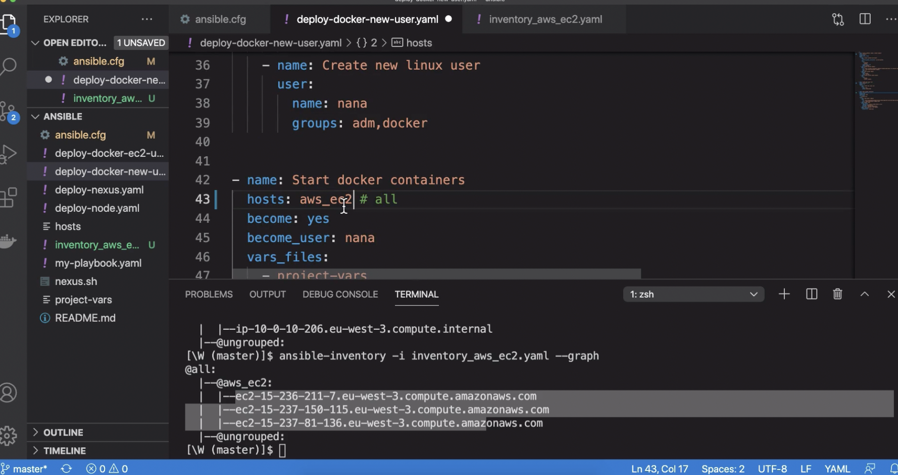
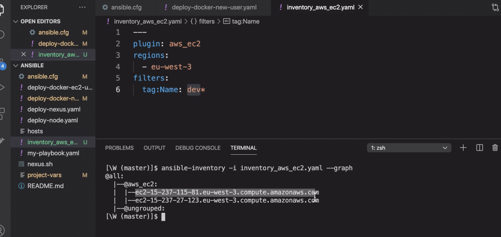
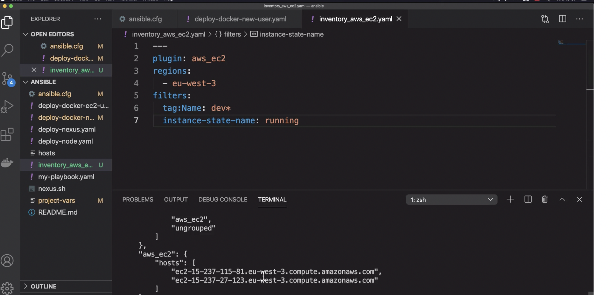
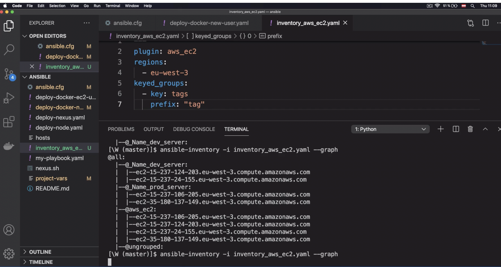

# Dynamic Inventory for EC2 Servers

## repo
https://github.com/ZQWang39/Ansible-demo/tree/dynamic-inventory-EC2

[amazon.aws.aws_ec2 inventory - EC2 inventory source - Ansible Documentation](https://docs.ansible.com/ansible/latest/collections/amazon/aws/aws_ec2_inventory.html)

## Requirements

`ansible-galaxy collection install amazon.aws --ignore-certs`

```yaml
❯ ansible-galaxy collection list

# /Users/zqwang/.ansible/collections/ansible_collections
Collection        Version
----------------- -------
amazon.aws        5.2.0  
community.docker  3.4.0  
community.general 6.3.0
```

`pip3 install botocore`

`pip3 install boto3`

`ansible.cfg` file:

```yaml
[defaults]
host_key_checking = False
inventory = hosts 
interpreter_python =/usr/bin/python3
**enable_plugins = amazon.aws.aws_ec2 <--**
```

## Write plugin configuration

`inventory_aws_ec2.yaml`

```yaml
---
plugin: aws_ec2
regions: 
  - ap-southeast-2
```

Enable public DNS for each instances:

`main.tf`

```yaml
# Create a VPC
resource "aws_vpc" "terraform-vpc-demo" {
  cidr_block = var.vpc_cidr_block
  **enable_dns_hostnames = true <--**
  tags = {
    Name = "${var.env_prefix}-vpc"
  }
}
```

`ansible-inventory -i inventory_aws_ec2.yaml --list`

`ansible-inventory -i inventory_aws_ec2.yaml --graph`

```yaml
@all:
  |--@ungrouped:
  |--@aws_ec2:
  |  |--ec2-13-211-171-51.ap-southeast-2.compute.amazonaws.com
  |  |--ec2-13-211-129-184.ap-southeast-2.compute.amazonaws.com
  |  |--ec2-3-26-171-203.ap-southeast-2.compute.amazonaws.com
```

Change hosts to the `group`/ or just leave it as `all`



Set private ssh key in `ansible.cfg` file:

```yaml
[defaults]
host_key_checking = False
inventory = hosts 
interpreter_python =/usr/bin/python3
enable_plugins = aws_ec2
**remote_user=ec2-user<--
private_key_file=~/.ssh/id_rsa<--**
```

Run:

`ansible-playbook -i inventory_aws_ec2.yaml deploy-docker-ec2.yaml`


or we can update `ansible.cfg`file, make the default hosts as `inventory_aws_ec2.yaml`


## Filter needed instances:

Create 2 different purpose of servers: Prod, Dev


Use `filter` attribute in ****`amazon.aws.aws_ec2 inventory` to filter the env we need:**



filter running instances:



## Create dynamic groups

`**keyed_groups`:**

by `tags`

