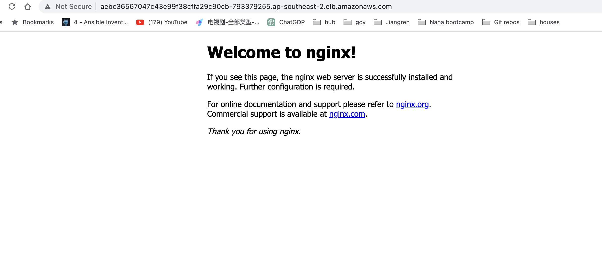

# Deploy to K8s

[kubernetes.core.k8s module - Manage Kubernetes (K8s) objects - Ansible Documentation](https://docs.ansible.com/ansible/latest/collections/kubernetes/core/k8s_module.html)

## Requirement

```yaml
python >= 3.6

kubernetes >= 12.0.0

PyYAML >= 3.11

jsonpatch
```

`pip3 install kubernetes`

`pip3 install yYAML`

`pip3 install jsonpatch`

`ansible-galaxy collection install kubernetes.core`

```yaml
❯ ansible-galaxy collection list

# /Users/zqwang/.ansible/collections/ansible_collections
Collection        Version
----------------- -------
amazon.aws        5.2.0  
community.docker  3.4.0  
community.general 6.3.0
```

## Create EKS

`terraform apply`

`aws eks update-kubeconfig --name myapp-eks-cluster`

## Create a namespace in EKS and deploy Nginx

`ansible.cfg`

```yaml
[defaults]
host_key_checking = False
**inventory = hosts <--**
interpreter_python =/usr/bin/python3
enable_plugins = aws_ec2
remote_user=ec2-user
private_key_file=~/.ssh/id_rsa
```

`deploy-to-k8s.yaml`

```yaml
---
- name: Update kubeconfig file
  hosts: localhost
  tasks:
    - name: Update kubeconfig file
      ansible.builtin.command: aws eks update-kubeconfig --name myapp-eks-cluster 

- name: Deploy app in a new namespace
  hosts: localhost
  tasks:
    - name: Create a k8s namespace
      kubernetes.core.k8s:
        name: my-app
        api_version: v1
        kind: Namespace
        state: present

    - name: Deploy Nginx app
      kubernetes.core.k8s:
        src: /Users/zqwang/nginx.yaml
        state: present
        namespace: my-app
```

```yaml
❯ ansible-playbook deploy-to-k8s.yaml

PLAY [Deploy app in a new namespace] *****************************************************************************************

TASK [Gathering Facts] *******************************************************************************************************
ok: [localhost]

TASK [Create a k8s namespace] ************************************************************************************************
changed: [localhost]

TASK [Deploy Nginx app] ******************************************************************************************************
changed: [localhost]

PLAY RECAP *******************************************************************************************************************
localhost                  : ok=3    changed=2    unreachable=0    failed=0    skipped=0    rescued=0    ignored=0
```

## 

```yaml
**❯ kubectl get ns**
NAME              STATUS   AGE
default           Active   14m
kube-node-lease   Active   14m
kube-public       Active   14m
kube-system       Active   14m
my-app            Active   24s

**❯ kubectl get pod -n my-app**
NAME                     READY   STATUS    RESTARTS   AGE
nginx-6c8b449b8f-qjq6b   1/1     Running   0          37s

**kubectl get services -n my-app**
NAME    TYPE           CLUSTER-IP     EXTERNAL-IP                                                                   PORT(S)        AGE
nginx   LoadBalancer   172.20.169.9   aebc36567047c43e99f38cffa29c90cb-793379255.ap-southeast-2.elb.amazonaws.com   80:31278/TCP   2m12s
```
