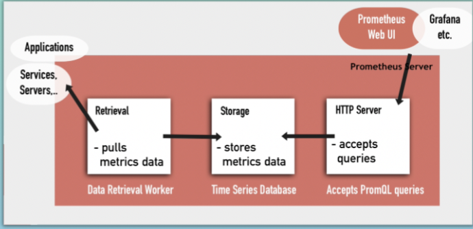
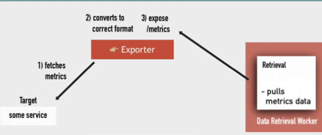
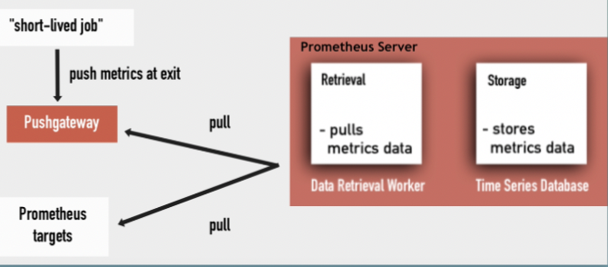
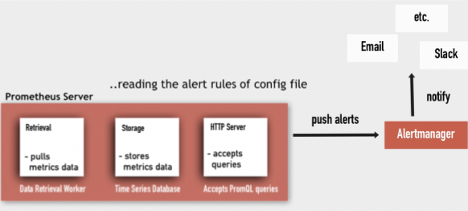
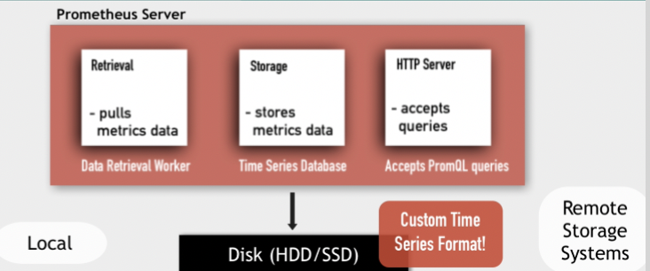
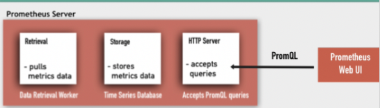

# Prometheus Architecture 

## How it all works

## Targets & Metrics
Prometheus pulls metrics from targets
* ### Targets
  * Linux/Win server
  * Apache server
  * Single application
  * Service

* ### Metrics
  * CPU status
  * Memory/Disk space/usage
  * Requests Count
  * Request Duration

## How Prometheus collects Metrics Data from Targets
* Prometheus pulls from HTTP endpoints
* Targets must expose: [hostaddress]/metrics
* Must be in correct format that Prometheusunderstand

## Exporters
Some services expose /metrics endpoints by defaultOthers need another component for that: Exporters
* Exporters help in exporting existing metrics from third-party systems as Prometheus metrics.
* An exporter is a services that fetches metrics from target and converts the data andexposes them as Prometheus metrics
* Prometheus can then scrape this endpoint asusua

## Push vs Pull
Important difference of Prometheus compared to other monitoring systems like Amazon CloudWatch or New Relic

* ### Prometheus - Pull Model
Prometheus pulls metrics from endpoints

* ### Others - Push Model
Services push to a centralized collection platform

* ### Pushgateway
* An intermediary service, which allows you to push metrics from jobs, which cannot be scraped 
* Prometheus recommends using the Pushgateway only in certain limited cases: Usually only valid use case forcapturing the outcome of a service-level batch job

## Alertmanager
* The Alertmanager handles alerts sent by Prometheus server
* Takes care of deduplicating, grouping and routing them to the correct receiver integrations
* Receiver of these alerts can be email,PagerDuty, Slack etc.

## Data Storage
* Prometheus includes a local on-disk time series database
* But optionally integrates with remote storage systems
* Data in local storage is stored in acustom, highly efficient format

## PromQL
* Prometheus provides a functional query language called PromQL
* Let's user select and aggregate time series data in real time
