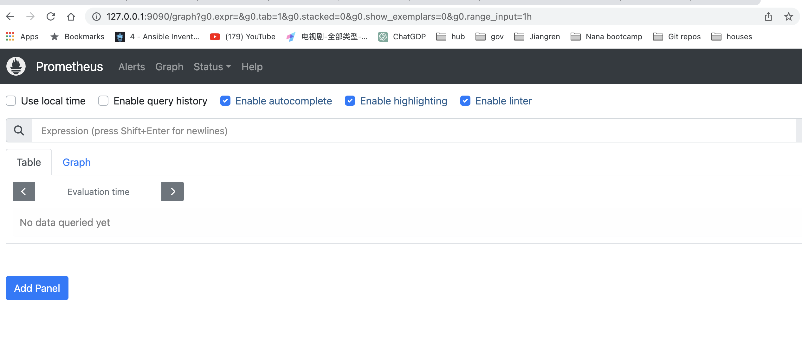
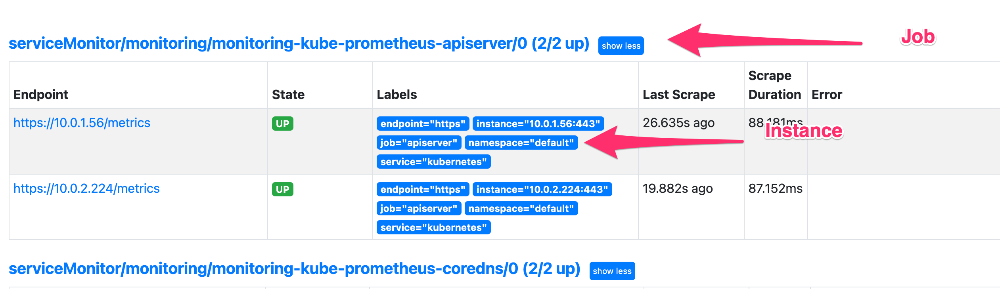
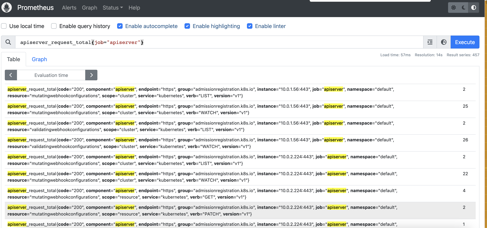

# Data Visualization

## Prometheus UI

### Get the Prometheus UI service:

`kubectl get service -n monitoring`

```yaml
NAME                                      TYPE        CLUSTER-IP       EXTERNAL-IP   PORT(S)                      AGE
alertmanager-operated                     ClusterIP   None             <none>        9093/TCP,9094/TCP,9094/UDP   45m
monitoring-grafana                        ClusterIP   172.20.180.123   <none>        80/TCP                       45m
monitoring-kube-prometheus-alertmanager   ClusterIP   172.20.22.208    <none>        9093/TCP                     45m
monitoring-kube-prometheus-operator       ClusterIP   172.20.141.104   <none>        443/TCP                      45m
**monitoring-kube-prometheus-prometheus     ClusterIP   172.20.84.149**    <none>        9090/TCP                     45m
monitoring-kube-state-metrics             ClusterIP   172.20.30.24     <none>        8080/TCP                     45m
monitoring-prometheus-node-exporter       ClusterIP   172.20.81.227    <none>        9100/TCP                     45m
prometheus-operated                       ClusterIP   None             <none>        9090/TCP                     45m
```

### Export the service by using `port-forward`:

`kubectl port-forward -n monitoring service/monitoring-kube-prometheus-prometheus 9090:9090 &`

```yaml
░▒▓    ~/b/pr/prometheus-eks-demo  Forwarding from 127.0.0.1:9090 -> 9090                           ✔    11:47:16  ▓▒░
Forwarding from [::1]:9090 -> 9090
Handling connection for 9090
Handling connection for 9090
Handling connection for 9090
```

### Instance&Job:

Instance = an endpoint you can scrape

Job = Collection of instances with the same purpose 

