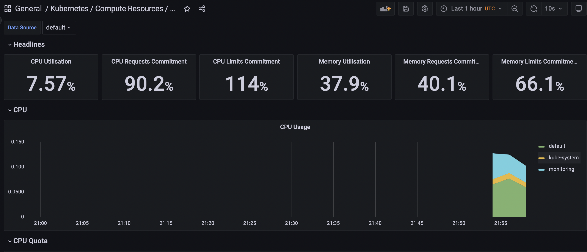
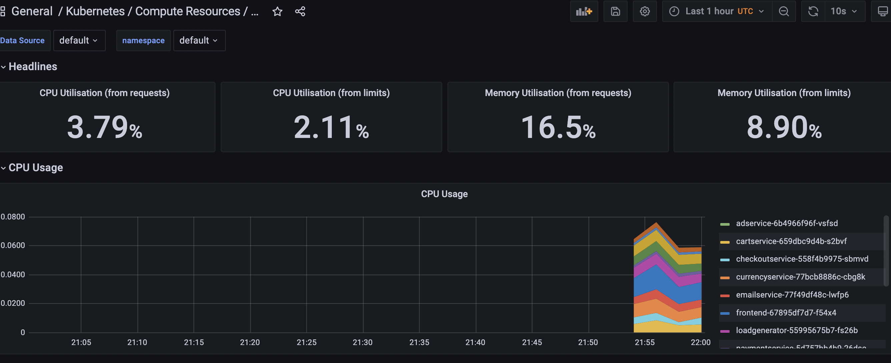
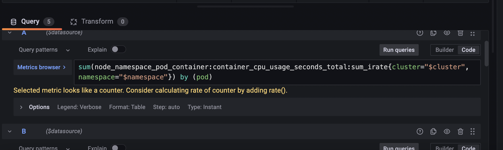
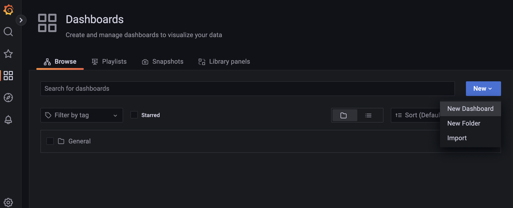
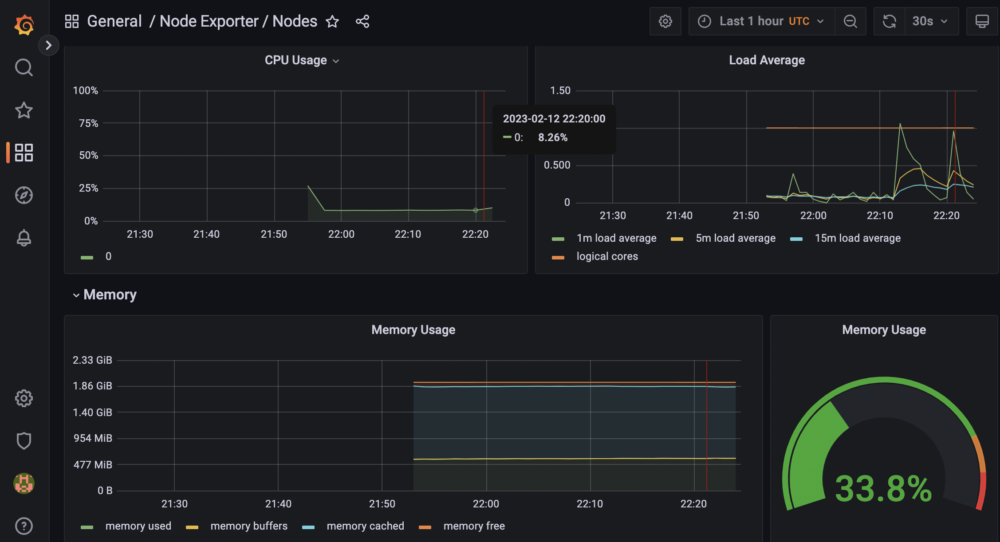
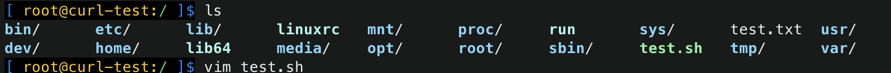
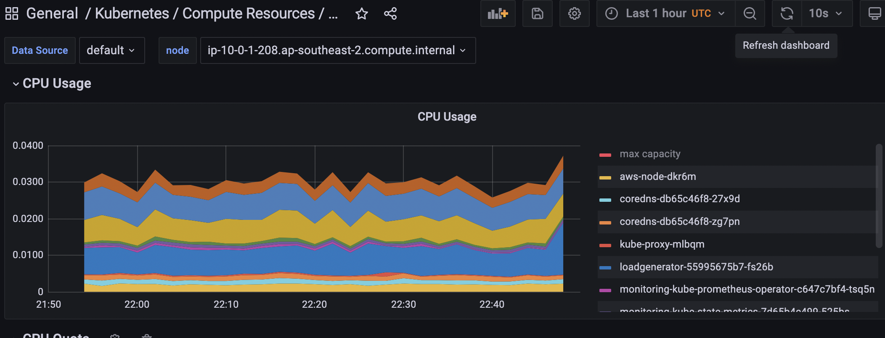
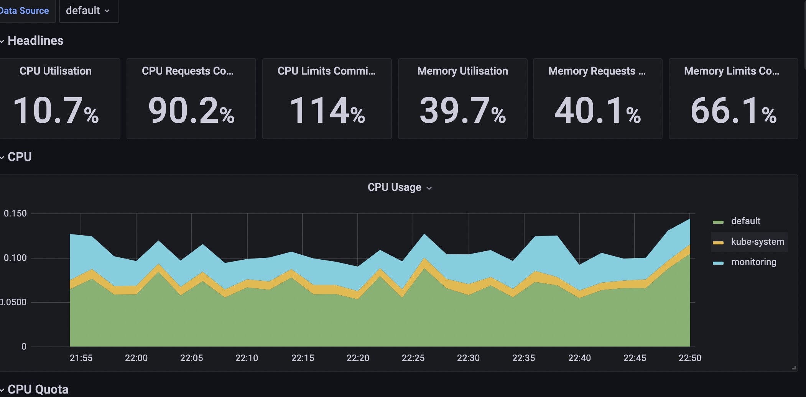
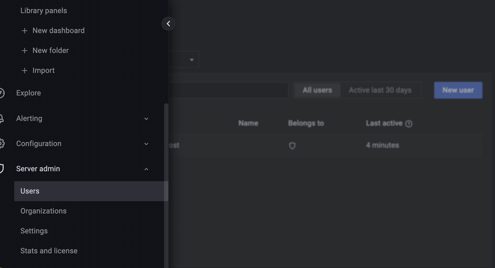
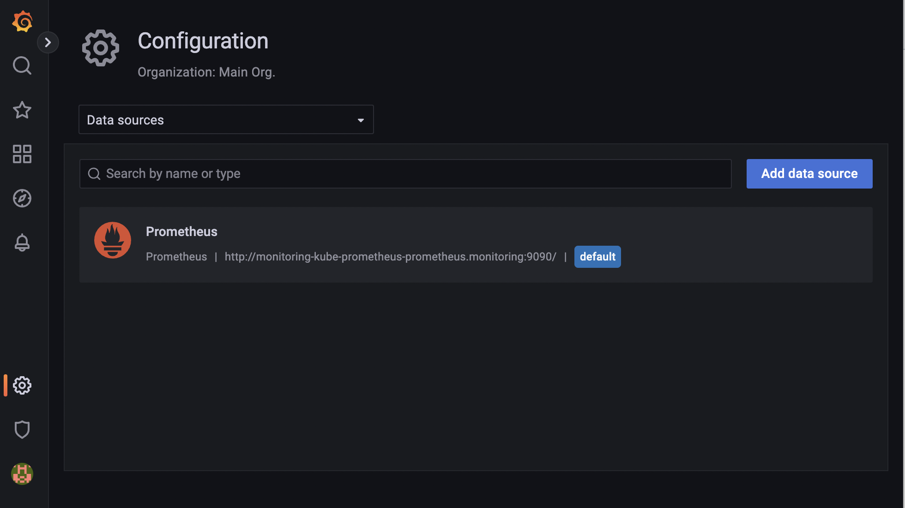

# Grafana UI
## Lauch Grafana UI:

### Services

```yaml
NAME                                              TYPE        CLUSTER-IP       EXTERNAL-IP   PORT(S)                      AGE
service/alertmanager-operated                     ClusterIP   None             <none>        9093/TCP,9094/TCP,9094/UDP   6m47s
service/monitoring-grafana                        ClusterIP   172.20.130.186   <none>        80/TCP                       6m55s
service/monitoring-kube-prometheus-alertmanager   ClusterIP   172.20.127.184   <none>        9093/TCP                     6m55s
service/monitoring-kube-prometheus-operator       ClusterIP   172.20.44.67     <none>        443/TCP                      6m55s
service/monitoring-kube-prometheus-prometheus     ClusterIP   172.20.199.16    <none>        9090/TCP                     6m55s
service/monitoring-kube-state-metrics             ClusterIP   172.20.12.94     <none>        8080/TCP                     6m55s
service/monitoring-prometheus-node-exporter       ClusterIP   172.20.144.185   <none>        9100/TCP                     6m55s
service/prometheus-operated                       ClusterIP   None             <none>        9090/TCP                     6m47s
```

### Launch Grafana UI:

`kubectl port-forward -n monitoring service/monitoring-grafana 8080:80 &`

### Grafana login credential:

```yaml
user:admin
pwd: prom-operator
```

### Kubernetes/compute resource/cluster



### Kubernetes/compute resource/Namespace(pods)



### Query


### Create a new dashboard


### Resource consumption of cluster nodes

**nodes**


### Test Anomaly

**Run the busybox:**

`kubectl run curl-test --image=radial/busyboxplus:curl -i --tty --rm`

**Run a script** 

`[ root@curl-test:/ ]$ vi [test.sh](http://test.sh/)`

```yaml
for i in $(seq 1 1000)
do
 curl http://a92c542f5c05e4d0da55467903d17360-899734065.ap-southeast-2.elb.amazonaws.com > test.txt
done
```

`[ root@curl-test:/ ]$ chmod u+x ./test.sh`

`[ root@curl-test:/ ]$ ./test.sh`



**CPU spike:**




## Configure users&data resources

**Add new users:**



**Data sources:**

