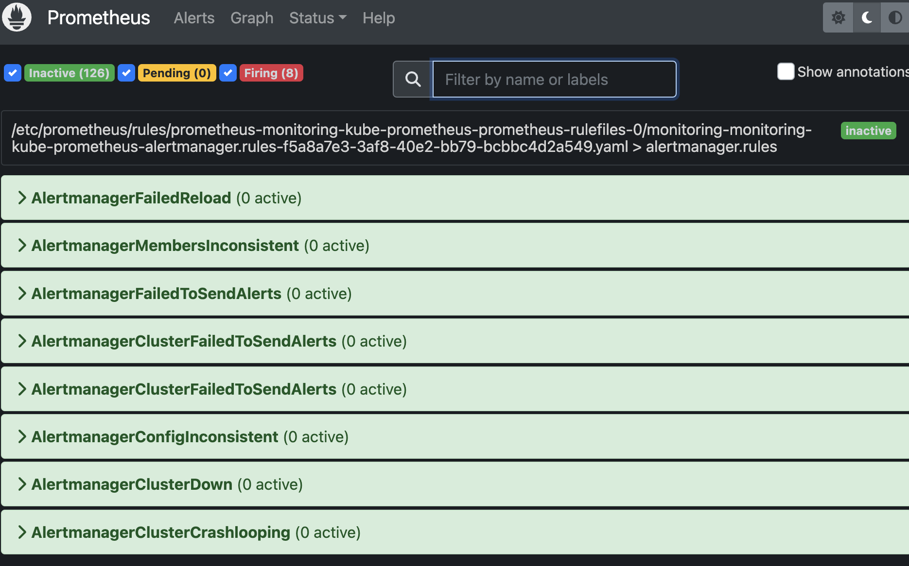

# Alert

## Alert Rules in Prometheus

### Existing alert rules in Prometheus




## Create alert rules

## Concept

**CRD**

Prometheus Operator extends the K8s API → Create a custom k8s resources → K8s operator take the custom k8s resources and tell Prometheus to reload the alert rules

**Prometheus → Configuration → rule_file:**


## `alert-rules.yaml`

```yaml
apiVersion: monitoring.coreos.com/v1
kind: PrometheusRule
metadata:
  name: main-rules
  namespace: monitoring
  labels:
    app: kube-prometheus-stack 
    release: monitoring
spec:
  groups:
  - name: main.rules
    rules:
    - alert: HostHighCpuLoad
      expr: 100 - (avg by(instance) (rate(node_cpu_seconds_total{mode="idle"}[2m])) * 100) > 50
      for: 2m
      labels:
        severity: warning
        namespace: monitoring
      annotations:
        description: "CPU load on host is over 50%\n Value = {{ $value }}\n Instance = {{ $labels.instance }}\n"
        runbook_url: https://runbook.example.com
        summary: "Host CPU load high"
    - alert: KubernetesPodCrashLooping
      expr: kube_pod_container_status_restarts_total > 5
      for: 0m
      labels:
        severity: critical
        namespace: monitoring
      annotations: 
        description: "Pod {{ $labels.pod }} is crash looping\n Value = {{ $value }}"
        runbook_url: https://runbook.example.com
        summary: "Kubernetes pod crash looping"
```

### `monitoring.coreos.com/v1`

The purpose of the **`monitoring.coreos.com/v1`** CRD is to provide a way to define and manage Prometheus monitoring resources within a Kubernetes cluster.

Prometheus is an open-source systems monitoring and alerting toolkit. The **`monitoring.coreos.com/v1`** CRD provides a higher-level API for defining and managing Prometheus resources, such as Prometheus instances, alert managers, and ServiceMonitors, within a Kubernetes cluster.

The use of a CRD for Prometheus monitoring allows for easier and more automated management of Prometheus resources within a Kubernetes cluster, as well as the ability to manage these resources using standard Kubernetes tools and APIs.

### kind: PrometheusRule

[Prometheus [monitoring.coreos.com/v1] - Monitoring APIs | API reference | OpenShift Container Platform 4.12](https://docs.openshift.com/container-platform/4.12/rest_api/monitoring_apis/prometheus-monitoring-coreos-com-v1.html)

[PrometheusRule [monitoring.coreos.com/v1] - Monitoring APIs | API reference | OpenShift Container Platform 4.12](https://docs.openshift.com/container-platform/4.12/rest_api/monitoring_apis/prometheusrule-monitoring-coreos-com-v1.html)

### groups:
  - name: main.rules


### Functions:

[Query functions | Prometheus](https://prometheus.io/docs/prometheus/latest/querying/functions/#functions)

## Execute configuration file:

`kubectl apply -f alert-rules.yaml`

```yaml
prometheusrule.monitoring.coreos.com/main-rules created
```

`kubectl get -n monitoring PrometheusRule`

```yaml
NAME                                                              AGE
main-rules     <--                                                   2m22s
monitoring-kube-prometheus-alertmanager.rules                     5h32m
monitoring-kube-prometheus-config-reloaders                       5h32m
monitoring-kube-prometheus-etcd                                   5h32m
monitoring-kube-prometheus-general.rules                          5h32m
monitoring-kube-prometheus-k8s.rules                              5h32m
monitoring-kube-prometheus-kube-apiserver-availability.rules      5h32m
monitoring-kube-prometheus-kube-apiserver-burnrate.rules          5h32m
monitoring-kube-prometheus-kube-apiserver-histogram.rules         5h32m
monitoring-kube-prometheus-kube-apiserver-slos                    5h32m
monitoring-kube-prometheus-kube-prometheus-general.rules          5h32m
monitoring-kube-prometheus-kube-prometheus-node-recording.rules   5h32m
monitoring-kube-prometheus-kube-scheduler.rules                   5h32m
monitoring-kube-prometheus-kube-state-metrics                     5h32m
monitoring-kube-prometheus-kubelet.rules                          5h32m
monitoring-kube-prometheus-kubernetes-apps                        5h32m
monitoring-kube-prometheus-kubernetes-resources                   5h32m
monitoring-kube-prometheus-kubernetes-storage                     5h32m
monitoring-kube-prometheus-kubernetes-system                      5h32m
monitoring-kube-prometheus-kubernetes-system-apiserver            5h32m
monitoring-kube-prometheus-kubernetes-system-controller-manager   5h32m
monitoring-kube-prometheus-kubernetes-system-kube-proxy           5h32m
monitoring-kube-prometheus-kubernetes-system-kubelet              5h32m
monitoring-kube-prometheus-kubernetes-system-scheduler            5h32m
monitoring-kube-prometheus-node-exporter                          5h32m
monitoring-kube-prometheus-node-exporter.rules                    5h32m
monitoring-kube-prometheus-node-network                           5h32m
monitoring-kube-prometheus-node.rules                             5h32m
monitoring-kube-prometheus-prometheus                             5h32m
monitoring-kube-prometheus-prometheus-operator                    5h32m
```

`kubectl -n monitoring get pod`

```yaml
NAME                                                     READY   STATUS      RESTARTS   AGE
alertmanager-monitoring-kube-prometheus-alertmanager-0   2/2     Running     0          5h34m
monitoring-grafana-55cdb9f755-vhb9b                      3/3     Running     0          5h34m
monitoring-kube-prometheus-admission-patch-jmb7r         0/1     Completed   0          5h34m
monitoring-kube-prometheus-operator-c647c7bf4-tsq5n      1/1     Running     0          5h34m
monitoring-kube-state-metrics-7d65b4c499-525bs           1/1     Running     0          5h34m
monitoring-prometheus-node-exporter-n89ds                1/1     Running     0          5h34m
monitoring-prometheus-node-exporter-ppt5p                1/1     Running     0          5h34m
monitoring-prometheus-node-exporter-sk2xj                1/1     Running     0          5h16m
prometheus-monitoring-kube-prometheus-prometheus-0       2/2     Running     0          5h34m
```

`kubectl logs -n monitoring prometheus-monitoring-kube-prometheus-prometheus-0`

```yaml
ts=2023-02-13T03:04:37.105Z caller=main.go:1234 level=info msg="Completed loading of configuration file" filename=/etc/prometheus/config_out/prometheus.env.yaml totalDuration=109.489794ms db_storage=2.025µs remote_storage=3.369µs web_handler=1.205µs query_engine=2.097µs scrape=2.790508ms scrape_sd=1.264379ms notify=17.337µs notify_sd=356.337µs rules=98.411942ms tracing=6.742µs
```

On Prometheus UI → alert:


## Test

[Docker](https://hub.docker.com/r/containerstack/cpustress)

Run the docker container in kubernetes:

`kubectl run cputest --image=containerstack/cpustress -- --cpu 4 --timeout 30s --metrics-brief`

```yaml
pod/cputest created
```

`kubectl get pod`

```yaml
NAME                                     READY   STATUS             RESTARTS        AGE
adservice-6b4966f96f-vsfsd               0/1     ImagePullBackOff   0               6h11m
cartservice-659dbc9d4b-s2bvf             1/1     Running            1 (130m ago)    6h11m
checkoutservice-558f4b9975-sbmvd         1/1     Running            0               6h12m
cputest        <--                          1/1     Running            0               20s
currencyservice-77bcb8886c-cbg8k         1/1     Running            0               6h11m
emailservice-77f49df48c-lwfp6            1/1     Running            0               6h12m
frontend-67895df7d7-f54x4                1/1     Running            0               6h12m
loadgenerator-55995675b7-fs26b           1/1     Running            5 (6h10m ago)   6h11m
paymentservice-5d757bb4b9-26dsc          1/1     Running            0               6h12m
productcatalogservice-5b4bd46dcc-fnrrt   1/1     Running            0               6h12m
recommendationservice-cfc4ccbbf-jwjt7    1/1     Running            0               6h12m
redis-cart-7667674fc7-gq29j              1/1     Running            0               6h11m
shippingservice-dd5647995-2ds7g          1/1     Running            0               6h11m
```

**General/
Kubernetes / Compute Resources / Namespace (Pods)**


**pending:**


**2 mins later, firing:**


`kubectl delete pod cputest`

```yaml
pod "cputest" deleted
```
