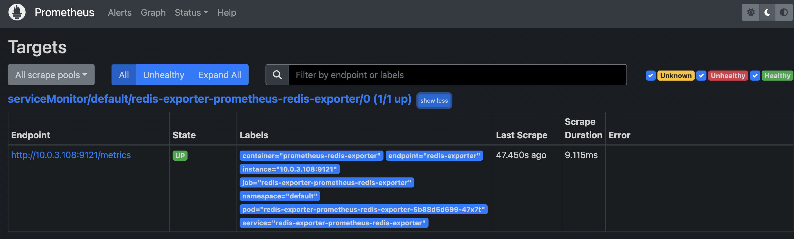
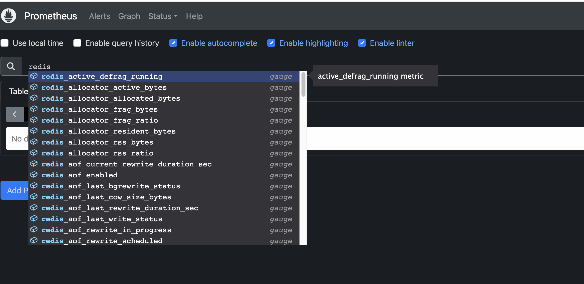
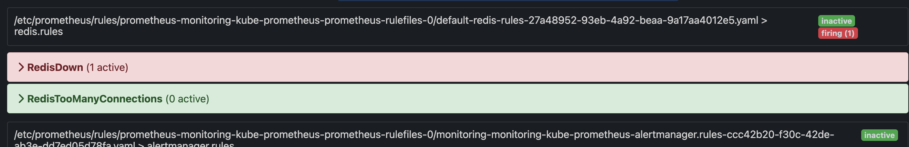
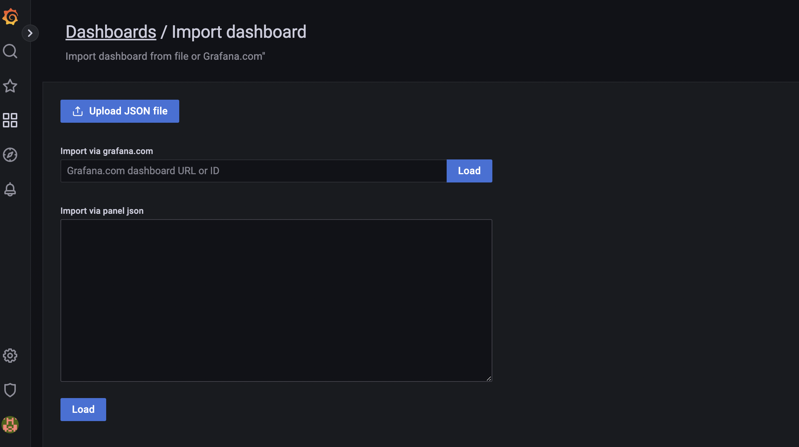
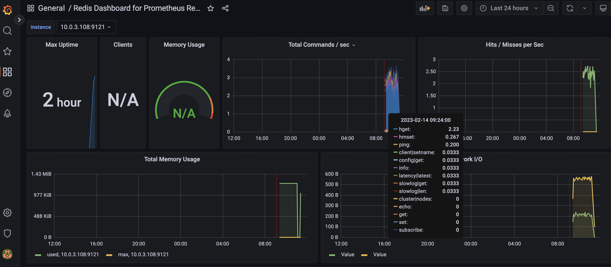
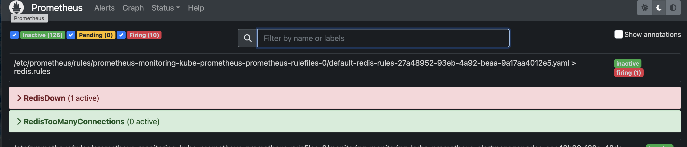

# Monitor Third-Party Applications

## Demo

### Config Redis exporter

### Install prometheus-redis-exporter

[helm-charts/charts/prometheus-redis-exporter at main · prometheus-community/helm-charts](https://github.com/prometheus-community/helm-charts/tree/main/charts/prometheus-redis-exporter)

[helm-charts/values.yaml at main · prometheus-community/helm-charts](https://github.com/prometheus-community/helm-charts/blob/main/charts/prometheus-redis-exporter/values.yaml)

#### Create `redis-values.yaml`

to overwrite some of the default values in  prometheus-redis-exporter, more importantly enable `service monitor`

```yaml
❯ kubectl get svc | grep redis
redis-cart              ClusterIP      172.20.0.25      <none>
```

```yaml
serviceMonitor:
  enabled: true
  labels:
    release: monitoring
redisAddress: redis://redis-cart:6379
```

#### Install prometheus-redis-exporter helm chart

`helm install redis-exporter prometheus-community/prometheus-redis-exporter -f redis-values.yaml`

```yaml
W0214 09:13:12.212236   79150 warnings.go:70] policy/v1beta1 PodSecurityPolicy is deprecated in v1.21+, unavailable in v1.25+
W0214 09:13:12.494638   79150 warnings.go:70] policy/v1beta1 PodSecurityPolicy is deprecated in v1.21+, unavailable in v1.25+
NAME: redis-exporter
LAST DEPLOYED: Tue Feb 14 09:13:11 2023
NAMESPACE: default
STATUS: deployed
REVISION: 1
TEST SUITE: None
NOTES:
1. Get the Redis Exporter URL by running these commands:
  export POD_NAME=$(kubectl get pods --namespace default -l "app=prometheus-redis-exporter,release=redis-exporter" -o jsonpath="{.items[0].metadata.name}")
  echo "Visit http://127.0.0.1:8080 to use your application"
  kubectl port-forward $POD_NAME 8080:
```

`helm uninstall redis-exporter`

#### To check the installation:

```yaml
❯ helm ls
NAME          	NAMESPACE	REVISION	UPDATED                              	STATUS  	CHART                          	APP VERSION
redis-exporter	default  	1       	2023-02-14 09:13:11.049093 +1000 AEST	deployed	prometheus-redis-exporter-5.3.0	v1.44.0
```

```yaml
❯ kubectl get pod
NAME                                                        READY   STATUS             RESTARTS      AGE
adservice-6b4966f96f-glzgc                                  0/1     ImagePullBackOff   0             35m
cartservice-659dbc9d4b-lmnm7                                1/1     Running            2 (35m ago)   35m
checkoutservice-558f4b9975-rs2rf                            1/1     Running            0             35m
currencyservice-77bcb8886c-zpms7                            1/1     Running            0             35m
emailservice-77f49df48c-r9gkn                               1/1     Running            0             35m
frontend-67895df7d7-cxr8s                                   1/1     Running            0             35m
loadgenerator-55995675b7-pw9z8                              1/1     Running            4 (34m ago)   35m
paymentservice-5d757bb4b9-z7gt9                             1/1     Running            0             35m
productcatalogservice-5b4bd46dcc-8jxt8                      1/1     Running            0             35m
recommendationservice-cfc4ccbbf-vhwrb                       1/1     Running            0             35m
redis-cart-7667674fc7-p4zqd                                 1/1     Running            0             35m
redis-exporter-prometheus-redis-exporter-85cf586f7d-jwr94   1/1     Running            0             2m40s
shippingservice-dd5647995-h9jvb                             1/1     Running            0             35m
```

```yaml
❯ kubectl get servicemonitor
NAME                                       AGE
redis-exporter-prometheus-redis-exporter   7s
```

`kubectl get servicemonitor redis-exporter-prometheus-redis-exporter -o yaml|less`

```yaml
apiVersion: monitoring.coreos.com/v1
kind: ServiceMonitor
metadata:
  annotations:
    meta.helm.sh/release-name: redis-exporter
    meta.helm.sh/release-namespace: default
  creationTimestamp: "2023-02-13T23:20:44Z"
  generation: 1
  labels:
    app.kubernetes.io/managed-by: Helm
    release: monitoring <--
  name: redis-exporter-prometheus-redis-exporter
  namespace: default
  resourceVersion: "17160"
  uid: 8144b674-8096-4d97-9be0-69d7948a37c4
spec:
  endpoints:
  - port: redis-exporter <--
  jobLabel: redis-exporter-prometheus-redis-exporter
  namespaceSelector:
    matchNames:
    - default
  selector:
    matchLabels:
      app.kubernetes.io/instance: redis-exporter
      app.kubernetes.io/name: prometheus-redis-exporter
```

#### The redis-exporter target has been added to Prometheus target:



### Alert rules&Grafana dashboard for redis

## Configure redis rules

**Alert rules library :**

[Awesome Prometheus alerts](https://awesome-prometheus-alerts.grep.to/)

**For redis:**

[Awesome Prometheus alerts](https://awesome-prometheus-alerts.grep.to/rules#redis)

`redis-rules.yaml`

```yaml
apiVersion: monitoring.coreos.com/v1
kind: PrometheusRule
metadata:
  name: redis-rules
  labels:
    app: kube-prometheus-stack 
    release: monitoring
spec:
  groups:
  - name: redis.rules
    rules:
**// Copy from the above libaray** 
    - alert: RedisDown
      expr: redis_up == 0
      for: 0m
      labels:
        severity: critical
      annotations:
        summary: Redis down (instance {{ $labels.instance }})
        description: "Redis instance is down\n  VALUE = {{ $value }}\n  LABELS = {{ $labels }}"
    - alert: RedisTooManyConnections
      expr: redis_connected_clients > 100
      for: 2m
      labels:
        severity: warning
      annotations:
        summary: Redis too many connections (instance {{ $labels.instance }})
        description: "Redis instance has {{ $value }} connections\n LABELS = {{ $labels }}"
```

`alert-manager-redis.yaml`

```yaml
apiVersion: monitoring.coreos.com/v1alpha1
kind: AlertmanagerConfig
metadata:
  name: redis-alert-config
spec:
  route:
    receiver: 'email'
    repeatInterval: 10m
    routes:
    - matchers:
      - name: alertname
        value: RedisDown
    - matchers:
      - name: alertname
        value: RedisTooManyConnections
  receivers:
  - name: 'email'
    emailConfigs:
    - to: 'ziqi.wang39@gmail.com'
      from: 'ziqi.wang666@gmail.com'
      smarthost: 'smtp.gmail.com:587'
      authUsername: 'ziqi.wang666@gmail.com'
      authIdentity: 'ziqi.wang666@gmail.com'
      authPassword:
       name: gmail-auth
       key: password
```

### Deploy redis rules

`kubectl apply -f redis-rules.yaml`

```yaml
prometheusrule.monitoring.coreos.com/redis-rules created
```

`kubectl get prometheusrule`

```yaml
NAME          AGE
redis-rules   43s
```

`kubectl apply -f email-secret.yaml`

```yaml
secret/gmail-auth created
```

`kubectl apply -f alert-manager-redis.yaml`

```yaml
alertmanagerconfig.monitoring.coreos.com/redis-alert-config created
```



### Import Grafana dashboard for Redis:

[Redis Dashboard for Prometheus Redis Exporter 1.x | Grafana Labs](https://grafana.com/grafana/dashboards/763-redis-dashboard-for-prometheus-redis-exporter-1-x/)

Copy Dashboard ID and enter in the below page:



## To test it

`kubectl get deployment`

```yaml
NAME                                       READY   UP-TO-DATE   AVAILABLE   AGE
adservice                                  0/1     1            0           147m
cartservice                                1/1     1            1           147m
checkoutservice                            1/1     1            1           147m
currencyservice                            1/1     1            1           147m
emailservice                               1/1     1            1           147m
frontend                                   1/1     1            1           147m
loadgenerator                              1/1     1            1           147m
paymentservice                             1/1     1            1           147m
productcatalogservice                      1/1     1            1           147m
recommendationservice                      1/1     1            1           147m
redis-cart                                 0/0     0            0           147m
redis-exporter-prometheus-redis-exporter   1/1     1            1           107m
shippingservice                            1/1     1            1           147m
```

`kubectl edit deployment redis-cart`

Change redis cart replica to 0

`kubectl get svc redis-exporter-prometheus-redis-exporter`

To address the endpoints

Grafana UI:


Prometheus alerts:

