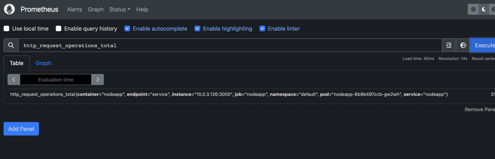
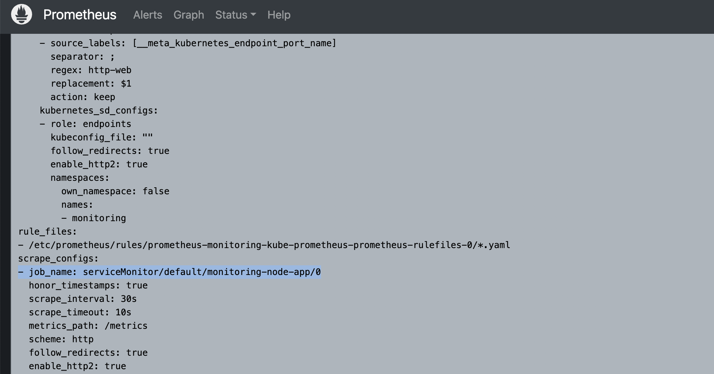

# Collect & Expose Metrics with Prometheus Client Library

## Collect&Expose metrics for the App

This part we need to tell Developers what kind of metrics we need so that Developers can use the respected client library to code what we need in the backend code and expose the data to `/metrics` like below:


for example for node.js:

****Prometheus client for node.js****

[npm: prom-client](https://www.npmjs.com/package/prom-client?activeTab=readme)

## Build docker image and push to docker hub

`docker build -t zqwang39/nodejs-demo-app:1.0 .` 

`docker login`

`docker push` `zqwang39/nodejs-demo-app:1.0`


## Deploy docker image into Kubernetes

### Create a secret file for docker

Due to the docker image is in private container repository, we need to configure `secret.yaml` for docker so that we can pull down the image

```yaml
apiVersion: v1
kind: Secret
metadata:
  name: my-docker-secret
type: kubernetes.io/dockerconfigjson
data:
  .dockerconfigjson: <base64-encoded-docker-config-json>
```

```yaml
cat ~/.docker/config.json | base64
```

### OR deploy the secret form the command line:

```yaml
kubectl create secret docker-registry my-registry-key --docker-server=https://index.docker.io/v1 --docker-username=zqwang39 --docker-password=mypasword --docker-email=ziqi.wang39@gmail.com
```

`docker-secret.yaml`

```yaml
apiVersion: v1
kind: Secret
metadata:
    name: my-registry-key
type: kubernetes.io/dockerconfigjson
data:
    .dockerconfigjson: ewogICJhdXRocyI6IHsKICAgICIxNTkuNjUuNy44NTo4MDgzIjoge30sCiAgICAiMjA2MDUzODIxNjE2LmRrci5lY3IuYXAtc291dGhlYXN0LTIuYW1hem9uYXdzLmNvbSI6IHt9LAogICAgImh0dHBzOi8vaW5kZXguZG9ja2VyLmlvL3YxLyI6IHt9CiAgfSwKICAiY3JlZHNTdG9yZSI6ICJkZXNrdG9wIgp9Cg==
```

`kubectl apply -f docker-secret.yaml`

## Deploy node.js app and ServiceMonitor to Kubernetes

```yaml
---
apiVersion: apps/v1
kind: Deployment
metadata:
  name: nodeapp
  labels:
    app: nodeapp
spec:
  selector:
    matchLabels:
      app: nodeapp
  template:
    metadata:
      labels:
        app: nodeapp
    spec:
      imagePullSecrets:
      - name: my-registry-key
      containers:
      - name: nodeapp
        image: zqwang39/nodejs-demo-app:1.1
        ports:
        - containerPort: 3000
        imagePullPolicy: Always  
---
apiVersion: v1
kind: Service
metadata:
  name: nodeapp
  labels:
    app: nodeapp
spec:
  type: ClusterIP
  selector:
    app: nodeapp
  ports:
  - name: service
    protocol: TCP
    port: 3000
    targetPort: 3000
---
apiVersion: monitoring.coreos.com/v1
kind: ServiceMonitor
metadata:
  name: monitoring-node-app
  labels:
    release: monitoring
    app: nodeapp
spec:
  endpoints:
  - path: /metrics
    port: service
    targetPort: 3000
  namespaceSelector:
    matchNames:
    - default
  selector:
    matchLabels:
      app: nodeapp
```

## Issue

However, somehow I just cannot get the container started:
`kubectl apply -f nodejs-k8s-config.yaml`

`kubectl get all`

```yaml
NAME                           READY   STATUS   RESTARTS      AGE
**pod/nodeapp-54c87bf6f7-rt7wx   0/1     Error    5 (89s ago)   3m12s**

NAME                 TYPE        CLUSTER-IP       EXTERNAL-IP   PORT(S)    AGE
service/kubernetes   ClusterIP   172.20.0.1       <none>        443/TCP    97m
service/nodeapp      ClusterIP   172.20.111.164   <none>        3000/TCP   3m12s

NAME                      READY   UP-TO-DATE   AVAILABLE   AGE
deployment.apps/nodeapp   0/1     1            0           3m12s

NAME                                 DESIRED   CURRENT   READY   AGE
replicaset.apps/nodeapp-54c87bf6f7   1         1         0       3m12s
```

`kubectl describe pod nodeapp-54c87bf6f7-rt7wx`

```yaml
Name:             nodeapp-54c87bf6f7-rt7wx
Namespace:        default
Priority:         0
Service Account:  default
Node:             ip-10-0-3-227.ap-southeast-2.compute.internal/10.0.3.227
Start Time:       Wed, 15 Feb 2023 09:08:13 +1000
Labels:           app=nodeapp
                  pod-template-hash=54c87bf6f7
Annotations:      kubernetes.io/psp: eks.privileged
Status:           Running
IP:               10.0.3.60
IPs:
  IP:           10.0.3.60
Controlled By:  ReplicaSet/nodeapp-54c87bf6f7
Containers:
  nodeapp:
    Container ID:   containerd://651543a7e95faca790f00c02b0cf1555f298506bc6b3985338fee2ae0a7cc9fb
    Image:          zqwang39/nodejs-demo-app:1.0
    Image ID:       docker.io/zqwang39/nodejs-demo-app@sha256:9e504465c2753314971f842c2ada67156c064f38b6e7f5870804c475ba0ac800
    Port:           3000/TCP
    Host Port:      0/TCP
    State:          Terminated
      Reason:       Error
      Exit Code:    1
      Started:      Wed, 15 Feb 2023 09:11:22 +1000
      Finished:     Wed, 15 Feb 2023 09:11:22 +1000
    Last State:     Terminated
      Reason:       Error
      Exit Code:    1
      Started:      Wed, 15 Feb 2023 09:09:56 +1000
      Finished:     Wed, 15 Feb 2023 09:09:56 +1000
    Ready:          False
    Restart Count:  5
    Environment:    <none>
    Mounts:
      /var/run/secrets/kubernetes.io/serviceaccount from kube-api-access-h7l5n (ro)
Conditions:
  Type              Status
  Initialized       True
  Ready             False
  ContainersReady   False
  PodScheduled      True
Volumes:
  kube-api-access-h7l5n:
    Type:                    Projected (a volume that contains injected data from multiple sources)
    TokenExpirationSeconds:  3607
    ConfigMapName:           kube-root-ca.crt
    ConfigMapOptional:       <nil>
    DownwardAPI:             true
QoS Class:                   BestEffort
Node-Selectors:              <none>
Tolerations:                 node.kubernetes.io/not-ready:NoExecute op=Exists for 300s
                             node.kubernetes.io/unreachable:NoExecute op=Exists for 300s
Events:
  Type     Reason     Age                    From               Message
  ----     ------     ----                   ----               -------
  Normal   Scheduled  3m22s                  default-scheduler  Successfully assigned default/nodeapp-54c87bf6f7-rt7wx to ip-10-0-3-227.ap-southeast-2.compute.internal
  Normal   Pulled     3m20s                  kubelet            Successfully pulled image "zqwang39/nodejs-demo-app:1.0" in 1.493307984s
  Normal   Pulled     3m18s                  kubelet            Successfully pulled image "zqwang39/nodejs-demo-app:1.0" in 1.486415637s
  Normal   Pulled     3m1s                   kubelet            Successfully pulled image "zqwang39/nodejs-demo-app:1.0" in 1.496352484s
  Normal   Created    2m31s (x4 over 3m20s)  kubelet            Created container nodeapp
  Normal   Started    2m31s (x4 over 3m20s)  kubelet            Started container nodeapp
  Normal   Pulled     2m31s                  kubelet            Successfully pulled image "zqwang39/nodejs-demo-app:1.0" in 1.475350493s
  Warning  BackOff    113s (x8 over 3m18s)   kubelet            Back-off restarting failed container
  Normal   Pulling    100s (x5 over 3m22s)   kubelet            Pulling image "zqwang39/nodejs-demo-app:1.0"
```

## Resolution:

The cause was I built the docker image `zqwang39/nodejs-demo-app:1.0` on my M2 Mac(ARM64), hence the container cannot be built on EC2 instances(amd64). So I re-built docker image `zqwang39/nodejs-demo-app:1.1` on an amd64 ubuntu VM and it works perfectly. 

`kubectl get all`

```yaml
NAME                           READY   STATUS    RESTARTS   AGE
**pod/nodeapp-6b9b497ccb-gw2wh   1/1     Running   0          19s**

NAME                 TYPE        CLUSTER-IP       EXTERNAL-IP   PORT(S)    AGE
service/kubernetes   ClusterIP   172.20.0.1       <none>        443/TCP    133m
service/nodeapp      ClusterIP   172.20.138.226   <none>        3000/TCP   19s

NAME                      READY   UP-TO-DATE   AVAILABLE   AGE
deployment.apps/nodeapp   1/1     1            1           19s

NAME                                 DESIRED   CURRENT   READY   AGE
replicaset.apps/nodeapp-6b9b497ccb   1         1         1       19s
```

## Testing

### Launch the app:

`kubectl port-forward service/nodeapp 3002:3000 &`


### Export Prometheus monitor UI:

`kubectl port-forward -n monitoring service/monitoring-kube-prometheus-prometheus 9090:9090 &`


**Keep refresh the site and on [`http://127.0.0.1:3002/metrics`](http://127.0.0.1:3002/metrics)we can see `http_request_operations_total 31`**


**On Prometheus Query:**



**Graph view:**


**Prometheus configuration:**



## Create a new monitor dashboard for Node.js App:

